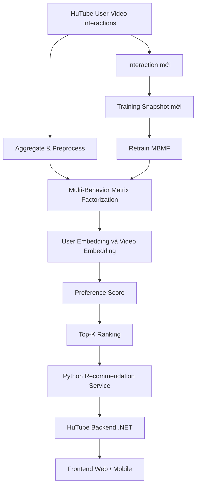
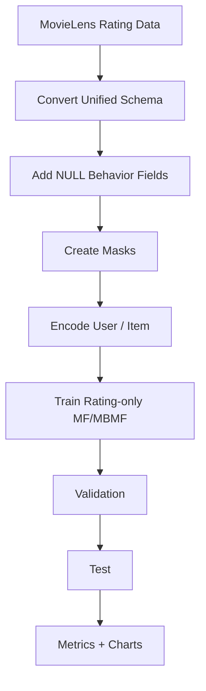
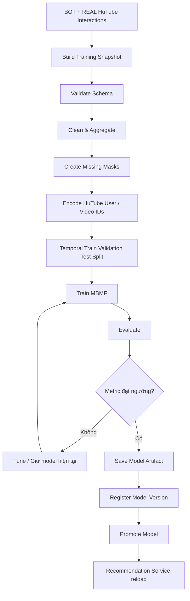
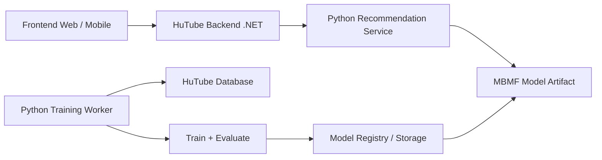
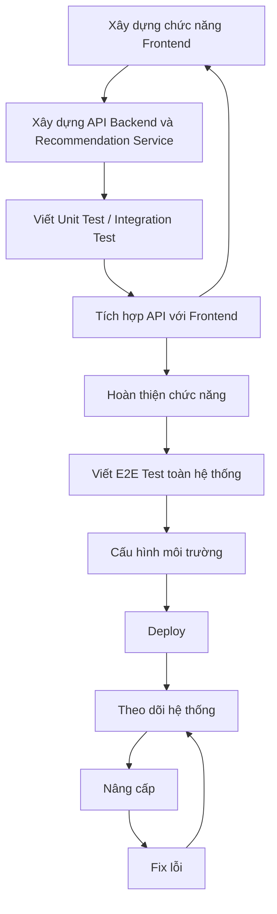

# Chi tiết Kế Hoạch Hoàn thiện chức năng gợi ý video bằng lọc cộng tác

## 2. Module Chức Năng

### 2.1. Thuật toán gợi ý bằng lọc cộng tác

#### 2.1.1. Mục tiêu

Module gợi ý có nhiệm vụ phân tích lịch sử tương tác giữa người dùng và video để học **mức độ phù hợp tiềm ẩn giữa User và Video**, từ đó sinh danh sách video đề xuất Top-K cho từng người dùng.

Mô hình chính được chốt cho HuTube là:

> **Model-Based Collaborative Filtering – Multi-Behavior Matrix Factorization (MBMF).**

Khác với Matrix Factorization truyền thống chỉ học từ một loại phản hồi như `rating`, MBMF của HuTube khai thác đồng thời nhiều tín hiệu trên quan hệ `User -> Video`:

- `rating`: đánh giá 1–5 sao;
- `like`: có thích video hay không;
- `dislike`: có không thích video hay không;
- `comment`: có phát sinh bình luận hay không;
- `share`: có chia sẻ video hay không;
- `watch_ratio`: tỷ lệ thời lượng video đã xem.

Quan hệ `Follow` **không đưa vào MBMF**, vì đây là quan hệ:

```text
User -> Channel
```

trong khi mô hình MBMF của module này chỉ khai thác:

```text
User -> Video
```

`Follow` được xử lý riêng bởi module Kênh/Subscription và có thể dùng để xây dựng Subscription Feed hoặc nguồn nội dung dự phòng khi hệ gợi ý chưa có đủ dữ liệu.

---

#### 2.1.2. Phân biệt Dataset Benchmark và Dataset Production

Module sử dụng hai nhóm dữ liệu với mục đích hoàn toàn khác nhau.

##### A. MovieLens – Benchmark/Baseline

MovieLens chỉ dùng để:

- kiểm tra pipeline huấn luyện hoạt động;
- kiểm tra implementation Matrix Factorization;
- đánh giá mô hình trong trường hợp chỉ có `rating`;
- thử nghiệm các hyperparameter ban đầu;
- tạo số liệu benchmark như RMSE, MAE, Precision@K, Recall@K, NDCG@K.

MovieLens **không phải dữ liệu huấn luyện production của HuTube** và model train từ MovieLens **không được deploy trực tiếp cho user/video HuTube**.

```text
MovieLens
   ↓
Rating-only benchmark
   ↓
Train / Validate / Test
   ↓
Metrics + Charts
   ↓
Xác nhận thuật toán và pipeline hoạt động
```

##### B. HuTube – Production Training Dataset

Model production được train bằng dữ liệu của HuTube:

```text
BOT synthetic interactions
        +
Real user interactions
        ↓
Multi-Behavior Dataset
        ↓
Train MBMF HuTube
        ↓
Production Model
```

Khi dữ liệu thật đủ lớn, dữ liệu BOT phải giảm vai trò và có thể bị loại khỏi các lần retrain sau.

> Không trộn MovieLens vào tập train production của HuTube.

---

#### 2.1.3. Kiến trúc tổng quát



Module được chia thành hai luồng chính.

**Offline Training**

```text
Database / Snapshot
      ↓
Preprocessing
      ↓
Training
      ↓
Evaluation
      ↓
Model Artifact
      ↓
Model Registry / Model Version
```

**Online Inference**

```text
Frontend
   ↓
HuTube Backend .NET
   ↓
Recommendation Service Python
   ↓
Model Inference
   ↓
Top-K Video IDs + Score
   ↓
.NET kiểm tra nghiệp vụ và lấy Video DTO
   ↓
Frontend
```

Frontend **không gọi trực tiếp** Recommendation Service Python.

---

#### 2.1.4. Unified Schema cho Pipeline

Để code preprocessing và training có thể dùng chung cấu trúc, dữ liệu được chuẩn hóa về schema:

```text
user_id
item_id
rating
like
dislike
comment
share
watch_ratio
source
timestamp
```

| Field | Kiểu dữ liệu | Ý nghĩa |
|---|---|---|
| `user_id` | string/int | ID người dùng |
| `item_id` | string/int | Movie trong benchmark hoặc Video trong HuTube |
| `rating` | float/null | Rating 1–5 |
| `like` | bool/null | Trạng thái Like |
| `dislike` | bool/null | Trạng thái Dislike |
| `comment` | bool/null | Có phát sinh bình luận |
| `share` | bool/null | Có phát sinh chia sẻ |
| `watch_ratio` | float/null | Tỷ lệ thời lượng đã xem, 0–1 |
| `source` | enum | `MOVIELENS`, `BOT`, `REAL` |
| `timestamp` | datetime | Thời điểm tương tác/snapshot |

`item_id` chỉ là tên cột dùng chung cho pipeline. `movie_id` của MovieLens và `video_id` của HuTube **không có quan hệ ID với nhau**.

---

#### 2.1.5. Cách xử lý MovieLens và các field phát sinh

MovieLens không có các trường:

```text
like
dislike
comment
share
watch_ratio
```

Để giữ cùng schema, các field này được thêm vào dưới dạng `NULL`.

Ví dụ:

```text
user_id | item_id | rating | like | dislike | comment | share | watch_ratio
--------------------------------------------------------------------------
1       | 10      | 4.5    | NULL | NULL    | NULL    | NULL  | NULL
1       | 20      | 3.0    | NULL | NULL    | NULL    | NULL  | NULL
2       | 10      | 5.0    | NULL | NULL    | NULL    | NULL  | NULL
```

Phải phân biệt:

```text
NULL
= Dataset không có thông tin về behavior này.

0
= Behavior có được quan sát nhưng không xảy ra.
```

Ví dụ:

```text
like = NULL
```

nghĩa là MovieLens không cung cấp dữ liệu Like.

Trong HuTube:

```text
like = 0
```

nghĩa là hệ thống có quan sát User–Video nhưng user hiện không Like video.

> Không được tự động biến toàn bộ `NULL` của MovieLens thành `0`, vì như vậy model sẽ hiểu sai rằng người dùng MovieLens đã được quan sát và đều không Like/Share/Comment.

---

#### 2.1.6. Missing Mask

Mask là cờ cho biết một giá trị có được quan sát hay không.

```text
1 = Có dữ liệu thật -> được phép tính loss.
0 = Missing/NULL -> bỏ qua khi tính loss.
```

Các mask:

```text
rating_mask
like_mask
dislike_mask
comment_mask
share_mask
watch_mask
```

MovieLens:

```text
rating = 5
rating_mask = 1

like = NULL
like_mask = 0

share = NULL
share_mask = 0
```

HuTube:

```text
rating = NULL
rating_mask = 0

like = 1
like_mask = 1

share = 0
share_mask = 1

watch_ratio = 0.87
watch_mask = 1
```

Loss của behavior `b` chỉ được tính trên sample có:

```text
mask_b = 1
```

Công thức dạng tổng quát:

\[
L_b =
\frac{
\sum_{(u,i)} M_{ui}^{(b)} \cdot \ell(y_{ui}^{(b)}, \hat y_{ui}^{(b)})
}{
\sum_{(u,i)} M_{ui}^{(b)} + \epsilon
}
\]

Trong benchmark MovieLens:

```text
rating_mask = 1
các behavior mask khác = 0
```

nên chỉ nhánh Rating được huấn luyện.

Trong production HuTube, behavior nào có dữ liệu thì behavior đó mới tham gia cập nhật model.

---

#### 2.1.7. Xử lý Watch Time

Không dùng trực tiếp số giây xem làm tín hiệu chính vì video có độ dài khác nhau.

Sử dụng:

\[
WatchRatio =
\frac{WatchSeconds}{VideoDurationSeconds}
\]

Giới hạn:

```text
0 <= watch_ratio <= 1
```

Ví dụ:

```text
Video A dài 30 phút, xem 5 phút
watch_ratio = 0.167

Video B dài 3 phút, xem đủ 3 phút
watch_ratio = 1.0
```

Video B phản ánh mức độ hoàn thành cao hơn dù tổng số giây xem thấp hơn.

Phiên bản đầu:

```text
watch_ratio = min(watch_seconds / duration_seconds, 1)
```

Nếu user xem lại nhiều lần thì vẫn giới hạn ở `1`. `rewatch_count` có thể được nghiên cứu ở phiên bản sau.

---

#### 2.1.8. Tổng hợp dữ liệu sự kiện HuTube

Không đưa raw event trực tiếp vào model.

Các event có thể gồm:

```text
VIEW_START
WATCH_PROGRESS
WATCH_END
LIKE
DISLIKE
COMMENT
SHARE
RATING
```

Training Pipeline phải aggregate chúng thành một snapshot trên mỗi cặp:

```text
(User, Video)
```

Ví dụ:

```text
User U01
Video V100

Rating       = 5
Like         = 1
Dislike      = 0
Comment      = 1
Share        = 0
WatchRatio   = 0.91
```

Snapshot:

```text
U01 | V100 | 5 | 1 | 0 | 1 | 0 | 0.91
```

Quy tắc aggregate phiên bản đầu:

```text
rating
→ rating gần nhất của user cho video

like / dislike
→ trạng thái hiện tại; Like và Dislike loại trừ nhau

comment
→ 1 nếu user có ít nhất một comment hợp lệ trên video, ngược lại 0

share
→ 1 nếu user đã từng share video, ngược lại 0

watch_ratio
→ tỷ lệ xem cao nhất/tỷ lệ xem tổng hợp đã chuẩn hóa và cap tại 1
```

`comment = 1` chỉ thể hiện **engagement**, không khẳng định comment là tích cực.

---

#### 2.1.9. Dữ liệu khởi tạo bằng Bot/Agent

Do hệ thống mới chưa có đủ interaction thật, cần script Bot/Agent tạo dữ liệu nền để:

- kiểm thử pipeline;
- train model HuTube ban đầu;
- mô phỏng system cold-start;
- phục vụ thực nghiệm KLCN.

Bot không được hành động ngẫu nhiên hoàn toàn.

Mỗi Agent có profile sở thích:

```text
Agent A
- Gaming: 0.9
- Football: 0.7
- Music: 0.2

Agent B
- Education: 0.9
- Technology: 0.8
- Gaming: 0.3
```

Profile này quyết định xác suất:

```text
xem video
watch_ratio
rating
like/dislike
comment
share
```

Dữ liệu BOT:

```text
source = BOT
```

Dữ liệu người dùng thật:

```text
source = REAL
```

Nguyên tắc production:

```text
Giai đoạn đầu:
BOT chiếm tỷ lệ lớn

Khi dữ liệu REAL tăng:
giảm BOT

Khi REAL đủ:
ưu tiên REAL hoặc train REAL-only
```

Bot không được dùng để tự tạo tương tác giả cho từng video mới trong production chỉ nhằm ép video đó vào recommendation.

---

#### 2.1.10. Kiến trúc Multi-Behavior Matrix Factorization

Kiến trúc MBMF đề xuất cho HuTube sử dụng **Shared User Embedding** và **Shared Video Embedding**, sau đó có tham số riêng theo từng behavior.

```text
                    User Embedding P(u)
                           │
                           │
                    Video Embedding Q(i)
                           │
        ┌──────────────────┼──────────────────┐
        ↓                  ↓                  ↓
      Rating              Like              Share
       Head               Head               Head
        │                  │                  │
        └───────────── Shared Latent Space ──┘
        │                  │                  │
     Dislike            Comment            Watch
       Head               Head               Head
```

Một dạng score cho behavior `b`:

$$
s_{ui}^{(b)} =
\sum_{k=1}^{d} w_k^{(b)} p_{u,k} q_{i,k}
+ b_u^{(b)}
+ b_i^{(b)}
+ c^{(b)}
$$

Trong đó:

- \(p_u\): User Embedding;
- \(q_i\): Video Embedding;
- \(w^{(b)}\): tham số riêng của behavior;
- \(d\): embedding dimension;
- \(b\): `rating`, `like`, `dislike`, `comment`, `share`, `watch`.

Các behavior **chia sẻ latent representation User/Video**, nên Like, Share, Comment, Watch… đều có thể cập nhật cùng không gian sở thích tiềm ẩn.

Không cần ép:

```text
Rating + Like + Share + Watch
```

thành một pseudo-rating bằng bộ trọng số tự đặt.

---

#### 2.1.11. Output Head và Hàm Loss

Các behavior có kiểu dữ liệu khác nhau nên sử dụng output/loss phù hợp.

| Behavior | Output | Loss đề xuất |
|---|---|---|
| Rating | giá trị 1–5 | MSE hoặc Huber |
| Like | xác suất 0–1 | Binary Cross Entropy |
| Dislike | xác suất 0–1 | Binary Cross Entropy |
| Comment | xác suất 0–1 | Binary Cross Entropy |
| Share | xác suất 0–1 | Binary Cross Entropy |
| Watch Ratio | giá trị 0–1 | Huber hoặc MSE |

Tổng loss:

$$
L =
\lambda_rL_r+
\lambda_lL_l+
\lambda_dL_d+
\lambda_cL_c+
\lambda_sL_s+
\lambda_wL_w+
L_{reg}
$$

Từng `L_b` đã được mask và normalize theo số sample quan sát được.

Không cố định cảm tính:

```text
Like = 20%
Share = 30%
Watch = 40%
```

Cấu hình triển khai ưu tiên:

```text
loss_weighting = uncertainty
```

tức các hệ số giữa task được học trong quá trình training bằng cơ chế trainable uncertainty weighting.

Nếu implementation này quá phức tạp trong giai đoạn đầu, fallback:

```text
loss_weighting = normalized_equal
```

với mỗi behavior loss được lấy mean trên số sample quan sát được rồi cộng với hệ số `1.0`.

Mọi thay đổi về loss weighting phải được đánh giá trên Validation Set.

---

#### 2.1.12. Preference Score và Top-K Recommendation

MBMF có nhiều behavior output nhưng Recommendation API cần một score duy nhất.

Phiên bản HuTube sử dụng một **Shared Preference Head** trên latent interaction:

$$
z_{ui} = p_u \odot q_i
$$

$$
PreferenceScore_{ui}
=
\sigma(w_p^Tz_{ui}+b_p)
$$

Preference Head chia sẻ User/Video Embedding với các behavior head.

Behavior Head giúp embedding học được:

```text
Rating
Like
Dislike
Comment
Share
Watch Ratio
```

Preference Head chịu trách nhiệm sinh score cuối để ranking.

Training Preference Head dùng positive/negative interaction pairs trong dữ liệu HuTube.

Positive interaction có thể được xác định bởi ít nhất một tín hiệu quan tâm rõ ràng, ví dụ:

```text
rating >= 4
OR like = 1
OR share = 1
OR watch_ratio >= configured_threshold
```

Các ngưỡng phải nằm trong config và được tune trên Validation Set, không hard-code trong source.

Model sinh:

```text
Video A = 0.92
Video B = 0.87
Video C = 0.63
```

sau đó:

```text
ORDER BY PreferenceScore DESC
```

để lấy Top-K.

Trong benchmark MovieLens, Preference Head có thể được đánh giá dựa trên rating relevance threshold.

---

#### 2.1.13. Quy trình Benchmark bằng MovieLens



Mục tiêu:

```text
Không deploy model MovieLens.
Không trộn MovieLens vào model HuTube.
Chỉ xác nhận thuật toán, code và pipeline đánh giá hoạt động.
```

---

#### 2.1.14. Quy trình Train Production HuTube



---

#### 2.1.15. Cấu hình Train mặc định

```yaml
model:
  type: MultiBehaviorMF
  embedding_dimension: 64
  preference_head: true

training:
  seed: 42
  optimizer: AdamW
  learning_rate: 0.001
  weight_decay: 0.00001
  batch_size: 1024
  max_epochs: 100

loss:
  rating: huber
  like: bce
  dislike: bce
  comment: bce
  share: bce
  watch_ratio: huber
  preference: bpr
  weighting: uncertainty

early_stopping:
  enabled: true
  patience: 8
  metric: ndcg@10
  mode: max

data_split:
  method: temporal
  train: 0.80
  validation: 0.10
  test: 0.10

negative_sampling:
  enabled: true
  negatives_per_positive: 4

relevance:
  rating_threshold: 4.0
  watch_ratio_threshold: 0.70

evaluation:
  k: [5, 10, 20]
```

Đây là **baseline config**, không phải giá trị tối ưu cuối cùng.

Các hyperparameter cần thử:

```text
Embedding Dimension:
32 / 64 / 128

Learning Rate:
0.0001 / 0.0005 / 0.001 / 0.005

Batch Size:
256 / 512 / 1024 / 2048

Negative Samples:
1 / 2 / 4 / 8

Watch Ratio Relevance Threshold:
0.50 / 0.60 / 0.70 / 0.80
```

Hyperparameter được chọn bằng Validation Set.

> Không dùng Test Set để chọn config.

---

#### 2.1.16. Chia Dataset

Ưu tiên **Temporal Split** thay vì Random Split.

```text
Tương tác cũ
   ↓
Train 80%

Tương tác tiếp theo
   ↓
Validation 10%

Tương tác mới nhất
   ↓
Test 10%
```

Mục tiêu:

```text
Dùng dữ liệu quá khứ
→ dự đoán tương tác tương lai
```

Temporal Split giúp mô phỏng production tốt hơn và giảm nguy cơ Data Leakage.

Phải đảm bảo:

- event của một thời điểm tương lai không xuất hiện trong Train;
- scaler/encoder thống kê chỉ fit từ Train khi phù hợp;
- Test chỉ được sử dụng sau khi đã chốt model/config.

---

#### 2.1.17. Chỉ số đánh giá

Việc đánh giá mô hình được chia thành 5 nhóm:

1. Ranking Metrics – đánh giá chất lượng danh sách Top-K.
2. Rating Prediction Metrics – đánh giá khả năng dự đoán Rating.
3. Binary Behavior Metrics – đánh giá Like, Dislike, Comment, Share.
4. Watch Ratio Metrics – đánh giá khả năng dự đoán tỷ lệ xem.
5. System-level Recommendation Metrics – đánh giá chất lượng hệ gợi ý ở mức toàn hệ thống.

---

##### A. Ranking Metrics – chỉ số chính

Ranking Metrics là nhóm chỉ số quan trọng nhất vì mục tiêu cuối cùng của hệ thống không chỉ là dự đoán Rating mà là:

> Đưa các video phù hợp nhất lên những vị trí đầu tiên trong danh sách đề xuất.

Ký hiệu:

```text
Rec_K(u)
= tập K video được model đề xuất cho user u.

Rel(u)
= tập video được xem là relevant với user u.
```

Một video có thể được xác định là relevant dựa trên cấu hình, ví dụ:

```text
rating >= 4

hoặc

like = 1

hoặc

share = 1

hoặc

watch_ratio >= threshold
```

Ngưỡng relevance phải được xác định trong config và tune bằng Validation Set.

---

###### 1. NDCG@K – Normalized Discounted Cumulative Gain

NDCG đánh giá đồng thời:

- video relevant có xuất hiện hay không;
- video relevant nằm ở vị trí nào;
- video phù hợp hơn có được xếp lên trên hay không.

Video relevant nằm ở vị trí đầu được tính giá trị cao hơn video nằm ở cuối danh sách.

DCG@K:

$$
DCG@K =
\sum_{i=1}^{K}
\frac{2^{rel_i}-1}
{\log_2(i+1)}
$$

Trong đó:

```text
i = vị trí của video trong danh sách đề xuất.

rel_i = mức relevance của video tại vị trí i.
```

Nếu chỉ sử dụng relevance nhị phân:

```text
Relevant     = 1
Not Relevant = 0
```

Sau đó tính danh sách lý tưởng:

$$
IDCG@K
$$

là DCG@K trong trường hợp các video relevant được sắp xếp tối ưu nhất.

NDCG:

$$
NDCG@K =
\frac{DCG@K}{IDCG@K}
$$

Khoảng giá trị:

```text
0 <= NDCG@K <= 1
```

Ý nghĩa:

```text
NDCG càng gần 1
→ thứ tự recommendation càng tốt.
```

Ví dụ:

```text
Model A:
Relevant video nằm ở vị trí 1, 2, 4

Model B:
Relevant video nằm ở vị trí 6, 8, 10
```

dù cả hai có thể tìm được cùng số video relevant, Model A sẽ có NDCG cao hơn.

Các giá trị sử dụng:

```text
NDCG@5
NDCG@10
NDCG@20
```

Chỉ số chính để Early Stopping:

```text
NDCG@10
```

Lý do:

> NDCG phù hợp trực tiếp với bài toán xếp hạng Top-K của hệ gợi ý HuTube.

---

###### 2. Precision@K

Precision@K trả lời câu hỏi:

> Trong K video được đề xuất, có bao nhiêu video thực sự relevant với user?

Công thức:

$$
Precision@K =
\frac{
|Rec_K(u) \cap Rel(u)|
}
{K}
$$

Ví dụ:

```text
Top-10 Recommendation
→ 10 video

Trong đó:
6 video relevant
```

thì:

$$
Precision@10 =
\frac{6}{10}
= 0.6
$$

Ý nghĩa:

```text
Precision cao
→ danh sách đề xuất ít video không phù hợp.
```

Các giá trị:

```text
Precision@5
Precision@10
Precision@20
```

---

###### 3. Recall@K

Recall@K trả lời câu hỏi:

> Trong toàn bộ video relevant mà user thực sự quan tâm, hệ thống tìm được bao nhiêu video trong Top-K?

Công thức:

$$
Recall@K =
\frac{
|Rec_K(u) \cap Rel(u)|
}
{|Rel(u)|}
$$

Ví dụ:

```text
User có 20 video relevant trong Test Set.

Top-10 của model tìm được 6 video.
```

thì:

$$
Recall@10 =
\frac{6}{20}
= 0.3
$$

Ý nghĩa:

```text
Recall cao
→ model bỏ sót ít video phù hợp.
```

Các giá trị:

```text
Recall@5
Recall@10
Recall@20
```

---

###### 4. HitRate@K

HitRate kiểm tra:

> Trong Top-K có ít nhất một video relevant hay không?

Với một user:

$$
Hit@K(u) =
\begin{cases}
1, & Rec_K(u) \cap Rel(u) \neq \emptyset \\
0, & \text{ngược lại}
\end{cases}
$$

HitRate trên toàn bộ user:

$$
HitRate@K =
\frac{
\sum_{u=1}^{N} Hit@K(u)
}
{N}
$$

Ví dụ:

```text
100 user test.

82 user nhận được ít nhất
1 relevant video trong Top-10.
```

thì:

$$
HitRate@10 =
\frac{82}{100}
= 0.82
$$

Ý nghĩa:

```text
HitRate cao
→ phần lớn user nhận được ít nhất một gợi ý hữu ích.
```

Các giá trị:

```text
HitRate@5
HitRate@10
HitRate@20
```

---

##### B. Rating Prediction Metrics

Rating Prediction Metrics đánh giá khả năng model dự đoán Rating của cặp User–Video.

Ký hiệu:

```text
r_ui
= rating thực tế.

r_hat_ui
= rating model dự đoán.

N
= số rating được đánh giá.
```

---

###### 1. MAE – Mean Absolute Error

MAE đo sai số tuyệt đối trung bình.

Công thức:

$$
MAE =
\frac{1}{N}
\sum_{(u,i)}
|r_{ui} - \hat r_{ui}|
$$

Ví dụ:

```text
Rating thật     = 5
Rating dự đoán  = 4.2

Sai số tuyệt đối = 0.8
```

Ý nghĩa:

```text
MAE càng thấp
→ Rating dự đoán càng gần Rating thật.
```

MAE dễ diễn giải vì cùng đơn vị với Rating.

---

###### 2. RMSE – Root Mean Squared Error

RMSE:

$$
RMSE =
\sqrt{
\frac{1}{N}
\sum_{(u,i)}
(r_{ui} - \hat r_{ui})^2
}
$$

So với MAE, RMSE phạt các lỗi dự đoán lớn mạnh hơn.

Ví dụ:

```text
Sai 0.2
→ ảnh hưởng nhỏ.

Sai 3.0
→ bị phạt mạnh.
```

Ý nghĩa:

```text
RMSE càng thấp
→ khả năng dự đoán Rating càng tốt.
```

Trong phần benchmark MovieLens:

```text
RMSE
MAE
```

là hai chỉ số quan trọng để kiểm tra Matrix Factorization hoạt động đúng.

---

##### C. Binary Behavior Prediction

Các behavior:

```text
Like
Dislike
Comment
Share
```

được xem là bài toán Binary Classification.

Ví dụ:

```text
Like:

1 = User Like Video
0 = User không Like Video
```

Model dự đoán:

```text
P(Like | User, Video)
```

Ví dụ:

```text
0.92
```

nghĩa là model dự đoán xác suất Like khoảng 92%.

---

###### 1. Precision và Recall của Binary Behavior

Binary Precision:

$$
Precision =
\frac{TP}{TP + FP}
$$

Trong đó:

```text
TP = True Positive
FP = False Positive
```

Binary Recall:

$$
Recall =
\frac{TP}{TP + FN}
$$

Trong đó:

```text
FN = False Negative
```

---

###### 2. PR-AUC – Area Under Precision-Recall Curve

PR Curve biểu diễn mối quan hệ giữa:

```text
Precision
và
Recall
```

khi thay đổi classification threshold.

PR-AUC là diện tích bên dưới Precision-Recall Curve.

Biểu diễn tổng quát:

$$
PR\text{-}AUC =
\int_0^1
Precision(Recall)
\, dRecall
$$

Giá trị càng cao càng tốt.

PR-AUC đặc biệt phù hợp với HuTube vì các hành vi như:

```text
Share
Comment
Dislike
```

có thể rất hiếm.

Ví dụ:

```text
10000 interaction

Share = 200
Not Share = 9800
```

Đây là dữ liệu mất cân bằng mạnh.

Trong trường hợp này PR-AUC thường có ý nghĩa hơn Accuracy.

---

###### 3. ROC-AUC

ROC Curve sử dụng:

```text
True Positive Rate
False Positive Rate
```

True Positive Rate:

$$
TPR =
\frac{TP}{TP + FN}
$$

False Positive Rate:

$$
FPR =
\frac{FP}{FP + TN}
$$

ROC-AUC là diện tích bên dưới ROC Curve:

$$
ROC\text{-}AUC =
\int_0^1
TPR(FPR)
\, dFPR
$$

Ý nghĩa trực quan:

> ROC-AUC đo khả năng model xếp một positive sample cao hơn một negative sample.

Khoảng:

```text
0.5
≈ gần random

1.0
= phân biệt hoàn hảo
```

HuTube sử dụng:

```text
PR-AUC
ROC-AUC
```

nhưng ưu tiên **PR-AUC** đối với behavior mất cân bằng mạnh.

---

##### D. Watch Ratio Prediction

Watch Ratio là biến liên tục:

```text
0 <= watch_ratio <= 1
```

Ví dụ:

```text
0.10
= xem khoảng 10%

0.85
= xem khoảng 85%

1.00
= xem hết video
```

Model dự đoán:

```text
watch_ratio_hat
```

Sử dụng MAE và RMSE.

---

###### 1. Watch Ratio MAE

$$
MAE_{watch} =
\frac{1}{N}
\sum_{(u,i)}
|w_{ui} - \hat w_{ui}|
$$

Ví dụ:

```text
Watch Ratio thật = 0.90
Model dự đoán    = 0.75
```

Sai số:

```text
0.15
```

---

###### 2. Watch Ratio RMSE

$$
RMSE_{watch} =
\sqrt{
\frac{1}{N}
\sum_{(u,i)}
(w_{ui} - \hat w_{ui})^2
}
$$

RMSE giúp phát hiện các trường hợp model dự đoán sai rất lớn.

Ví dụ:

```text
Thực tế xem 95%
nhưng model dự đoán 10%
```

sẽ bị phạt mạnh hơn bằng RMSE.

---

##### E. System-level Recommendation Metrics

Các metric phía trên đánh giá độ chính xác của model.

Tuy nhiên một hệ thống recommendation tốt không nên chỉ tập trung vào Accuracy.

Ví dụ:

```text
Nếu model luôn đề xuất 20 video nổi tiếng nhất
```

có thể Precision khá cao nhưng hệ thống:

```text
ít đa dạng
không khám phá video mới
chỉ tập trung vào creator lớn
```

Do đó cần thêm System-level Metrics.

---

###### 1. Catalog Coverage

Catalog Coverage đo tỷ lệ video trong toàn bộ hệ thống từng xuất hiện trong danh sách recommendation.

Công thức:

$$
Coverage =
\frac{
|\bigcup_{u \in U} Rec_K(u)|
}
{|I|}
$$

Trong đó:

```text
I
= toàn bộ video đủ điều kiện recommendation.
```

Ví dụ:

```text
Catalog có 10,000 video.

Trong quá trình đánh giá,
2,500 video khác nhau từng được recommend.
```

thì:

$$
Coverage =
\frac{2500}{10000}
= 0.25
$$

tức:

```text
25% Catalog Coverage.
```

Coverage quá thấp có thể cho thấy model chỉ tập trung vào một số video phổ biến.

---

###### 2. Recommendation Diversity

Diversity đo mức độ khác nhau giữa các video trong cùng một danh sách recommendation.

Một cách tính:

$$
Diversity(u) =
1 -
\frac{
2
}{
K(K-1)
}
\sum_{i<j}
Sim(i,j)
$$

Trong đó:

```text
Sim(i,j)
= độ tương đồng giữa hai video.
```

Nếu các video rất giống nhau:

```text
Similarity cao
→ Diversity thấp.
```

Nếu danh sách có nhiều nội dung khác nhau:

```text
Similarity thấp
→ Diversity cao.
```

Ví dụ:

```text
10 recommendation

cả 10 đều cùng một chủ đề rất giống nhau
→ Diversity thấp.
```

---

###### 3. Novelty

Novelty đo khả năng recommendation cho user những video ít phổ biến hơn mà user có khả năng chưa biết tới.

Một công thức phổ biến:

$$
Novelty(i) =
-\log_2
\left(
\frac{popularity(i)}
{\sum_j popularity(j)}
\right)
$$

Novelty của danh sách:

$$
Novelty@K =
\frac{1}{K}
\sum_{i \in Rec_K(u)}
Novelty(i)
$$

Video cực kỳ phổ biến:

```text
Novelty thấp.
```

Video ít phổ biến:

```text
Novelty cao.
```

Mục tiêu không phải maximize Novelty tuyệt đối mà cần cân bằng:

```text
Accuracy
+
Novelty
+
Diversity
```

---

###### 4. Fallback Rate

Fallback Rate đo tỷ lệ request mà hệ thống không sử dụng được MBMF và phải trả feed dự phòng.

Ví dụ fallback:

```text
Trending
Popular
New Videos
Subscription
```

Công thức:

$$
FallbackRate =
\frac{
NumberOfFallbackRequests
}{
TotalRecommendationRequests
}
$$

Ví dụ:

```text
10,000 recommendation request

1,200 request dùng fallback
```

thì:

$$
FallbackRate =
\frac{1200}{10000}
= 0.12
$$

tức:

```text
12%
```

Fallback Rate cao có thể cho thấy:

```text
nhiều user cold-start
model quá cũ
model service lỗi
nhiều video chưa tồn tại trong model
```

---

###### 5. Cold-start Rate

Cold-start Rate đo tỷ lệ user hoặc video chưa đủ dữ liệu để model cá nhân hóa.

Có thể tách thành:

```text
User Cold-start Rate
Video Cold-start Rate
```

User Cold-start:

$$
UserColdStartRate =
\frac{
ColdStartUsers
}{
ActiveUsers
}
$$

Video Cold-start:

$$
VideoColdStartRate =
\frac{
ColdStartVideos
}{
EligibleVideos
}
$$

Điều kiện để được xem là cold-start phải cấu hình rõ.

Ví dụ:

```text
User:
interaction_count < 5

Video:
interaction_count < 10
hoặc
video chưa tồn tại trong model version hiện tại
```

Các threshold này là config và có thể thay đổi sau thực nghiệm.

---

##### F. Chỉ số chính thức dùng để so sánh model

Để tránh báo cáo quá nhiều metric nhưng không biết metric nào quan trọng nhất, HuTube ưu tiên:

```text
Primary Metric:
NDCG@10
```

Các metric hỗ trợ:

```text
Recall@10
Precision@10
HitRate@10

RMSE
MAE

PR-AUC
ROC-AUC

Catalog Coverage
Diversity
Novelty
```

Trong quá trình train:

```text
Early Stopping
→ NDCG@10 trên Validation Set.
```

Trong báo cáo cuối:

```text
Validation Set
→ chọn hyperparameter.

Test Set
→ báo cáo kết quả cuối cùng.
```

Không sử dụng Test Set để lựa chọn model hoặc hyperparameter.

#### 2.1.18. Các biểu đồ bắt buộc

Training/Evaluation Pipeline phải sinh ít nhất các biểu đồ sau.

##### 1. Training Loss và Validation Loss theo Epoch

Mục đích:

```text
phát hiện overfitting
phát hiện underfitting
phát hiện training instability
```

##### 2. NDCG theo K

```text
NDCG@5
NDCG@10
NDCG@20
```

##### 3. Precision@K và Recall@K

So sánh theo:

```text
K = 5 / 10 / 20
```

##### 4. Rating Distribution

```text
1 sao
2 sao
3 sao
4 sao
5 sao
```

##### 5. Behavior Distribution

```text
Like
Dislike
Comment
Share
Rating
Watch Ratio
```

Dùng để thấy behavior imbalance.

##### 6. Missing Data / Behavior Coverage

Ví dụ benchmark MovieLens:

```text
Rating        100%
Like            0%
Dislike         0%
Comment         0%
Share           0%
WatchRatio      0%
```

HuTube production phải hiển thị tỷ lệ observed thực tế.

##### 7. PR Curve cho các binary behavior quan trọng

Ưu tiên:

```text
Like
Share
Comment
```

##### 8. Model Metrics theo Version

Theo dõi:

```text
NDCG@10
Recall@10
RMSE
Coverage
```

qua:

```text
Model v1
Model v2
Model v3
...
```

---

#### 2.1.19. Model Artifact và Versioning

Mỗi model production phải có một version độc lập.

Ví dụ:

```text
mbmf_2026_09_05_v1
mbmf_2026_09_06_v2
```

Một model artifact gồm:

```text
model.pt
config.yaml
metrics.json
metadata.json
user_index.json
video_index.json
```

Metadata ví dụ:

```json
{
  "modelVersion": "mbmf_2026_09_05_v1",
  "trainedAt": "...",
  "datasetSize": 50231,
  "realInteractions": 30021,
  "botInteractions": 20210,
  "ndcg10": 0.71,
  "recall10": 0.66,
  "rmse": 0.84
}
```

Không đưa `movieLensInteractions` vào metadata model production vì MovieLens không được dùng để train model HuTube.

Model mới chỉ được Promote nếu:

- train thành công;
- artifact hợp lệ;
- metric không thấp hơn ngưỡng chấp nhận;
- inference smoke test thành công.

Nếu không đạt, tiếp tục sử dụng model production hiện tại.

---

#### 2.1.20. Lịch Retrain

Trong development:

```text
Retrain thủ công.
```

Production mặc định:

```text
Full retrain 1 lần/ngày.
```

Ví dụ:

```text
02:00
  ↓
Build Training Snapshot
  ↓
Train
  ↓
Evaluate
  ↓
Smoke Test
  ↓
Promote nếu đạt
```

Schedule phải configurable.

Khi dữ liệu tăng lớn có thể chuyển sang:

```text
Warm Start / Incremental Update thường xuyên
+
Full Retrain định kỳ
```

Phiên bản KLCN ưu tiên full retrain hàng ngày vì:

- đơn giản;
- dễ kiểm soát;
- dễ tái lập kết quả;
- dataset chưa ở quy mô lớn.

---

#### 2.1.21. Cold-start User và Video

##### User mới

User chưa có interaction:

```text
MBMF không có đủ dữ liệu cá nhân hóa.
```

Fallback:

```text
Trending
Popular
New Videos
Subscription nếu đã Follow
```

Sau khi user phát sinh interaction, dữ liệu được đưa vào Training Snapshot và model học ở lần retrain tiếp theo.

##### Video mới

Video vừa upload chưa có interaction:

```text
0 Rating
0 Like
0 Dislike
0 Comment
0 Share
0 Watch
```

Collaborative Filtering chưa thể đánh giá chính xác.

Video mới có thể nhận traffic ban đầu từ:

```text
Subscription Feed
Search
Channel Page
New Videos
Trending/Explore
External traffic
```

Khi có interaction:

```text
Interaction
   ↓
Training Snapshot
   ↓
Retrain
   ↓
Model bắt đầu học Video
```

---

#### 2.1.22. Kiến trúc triển khai Backend và Python

Không implement toàn bộ ML trực tiếp trong Backend .NET.

Đề xuất:

```text
Python:
- PyTorch
- Pandas
- NumPy
- Scikit-learn
- FastAPI

Backend:
- .NET
```

Kiến trúc:



Trách nhiệm Python:

```text
Preprocessing
Training
Evaluation
Model Loading
Inference
Top-K scoring
```

Trách nhiệm .NET:

```text
Authentication
Authorization
Business rules
Video visibility
Blocked/Deleted video filtering
Channel permission
Pagination
Public API contract
Response DTO
Fallback
```

Python Recommendation Service nên chỉ truy cập dữ liệu cần thiết cho inference; việc hydrate đầy đủ Video DTO nên để .NET xử lý.

---

#### 2.1.23. Luồng Online Recommendation

```text
Frontend
   ↓
GET /api/v1/recommendations/home
   ↓
.NET xác định User
   ↓
.NET gọi Python Recommendation Service
   ↓
Python trả Top-K Video ID + Score
   ↓
.NET lấy Video từ Database
   ↓
lọc Deleted / Private / Blocked / không đủ quyền
   ↓
bù thêm candidate nếu thiếu
   ↓
Video DTO
   ↓
Frontend
```

Nếu Python Service timeout/error:

```text
.NET không làm Home chết
→ dùng fallback feed
```

---

#### 2.1.24. Recommendation API

##### Public API

```http
GET /api/v1/recommendations/home?limit=20
```

Response:

```json
{
  "items": [
    {
      "videoId": "...",
      "title": "...",
      "thumbnailUrl": "...",
      "channel": {},
      "duration": 312
    }
  ],
  "modelVersion": "mbmf_2026_09_05_v1",
  "source": "RECOMMENDATION"
}
```

Frontend không cần biết:

```text
User Embedding
Video Embedding
Raw latent vector
Behavior head output
```

##### Internal Recommendation API

.NET gọi Python:

```http
POST /internal/recommendations
```

Request:

```json
{
  "userId": "...",
  "limit": 50,
  "excludeVideoIds": []
}
```

Response:

```json
{
  "modelVersion": "mbmf_2026_09_05_v1",
  "items": [
    {
      "videoId": "...",
      "score": 0.92
    }
  ]
}
```

Internal service phải được bảo vệ bằng private network hoặc service credential; không expose trực tiếp ra Internet nếu không cần thiết.

##### Admin API

```http
GET /api/v1/admin/recommendation/model
POST /api/v1/admin/recommendation/retrain
GET /api/v1/admin/recommendation/history
POST /api/v1/admin/recommendation/models/{version}/rollback
```

---

#### 2.1.25. Frontend

##### User Web / Mobile

Trang Home có khu vực/feed:

```text
Recommended For You
```

Yêu cầu:

- Infinite Scroll;
- loading state;
- retry/fallback;
- không hiển thị video bị xóa/private;
- hỗ trợ pagination/cursor từ Backend;
- không hiển thị thông tin kỹ thuật của model.

Nếu recommendation chưa khả dụng:

```text
Fallback
→ Trending / Popular / New Videos / Subscription
```

##### Admin Web

Màn hình:

```text
Recommendation Management
```

Hiển thị:

```text
Current Model Version
Last Successful Train
Training Status
Dataset Size
BOT / REAL ratio
NDCG@10
Recall@10
Precision@10
RMSE
Behavior Coverage
Fallback Rate
```

Chức năng:

```text
Trigger Retrain
View Training History
View Metrics/Charts
View Model Metadata
Rollback Model
```

---

#### 2.1.26. Unit Test

##### Python

Phải test:

```text
NULL -> mask đúng
0 không bị hiểu thành missing
Watch Ratio tính đúng
Aggregate event đúng
Like/Dislike mutual exclusion đúng
User/Video encoding đúng
Temporal split không leakage
Loss bỏ qua field mask = 0
Loss behavior đúng loại
Negative sampling không lấy positive item
Model forward đúng shape/range
Top-K không duplicate
Model save/load đúng
Mapping save/load đúng
Seed reproducible
```

##### .NET Backend

Phải test:

```text
User chưa login -> 401 nếu endpoint yêu cầu auth
User hợp lệ -> trả recommendation
Recommendation Service timeout -> fallback
Recommendation Service 5xx -> fallback
Video bị xóa -> bị lọc
Video private -> bị lọc theo quyền
Duplicate video -> loại bỏ
Limit/cursor -> validate
Internal response sai schema -> xử lý an toàn
```

---

#### 2.1.27. Integration Test

Kiểm tra luồng:

```text
HuTube Database
→ Training Worker
→ Model Artifact
→ Recommendation Service
→ .NET Backend
→ Frontend contract
```

Các case:

```text
Build snapshot thành công
Train model thành công
Artifact được version
Service load đúng model
Service trả Top-K
.NET hydrate đúng Video DTO
Deleted/private video bị lọc
Fallback hoạt động
Rollback model hoạt động
```

---

#### 2.1.28. E2E Test

##### E2E 01 – User có lịch sử tương tác

```text
Login
 ↓
Open Home
 ↓
Backend gọi Recommendation Service
 ↓
Top-K được trả
 ↓
Video Recommendation hiển thị
```

##### E2E 02 – User mới

```text
Register/Login
 ↓
Không có embedding hoặc chưa đủ interaction
 ↓
Recommendation fallback
 ↓
Home vẫn có nội dung
```

##### E2E 03 – Interaction -> Retrain -> Model Version mới

```text
User xem/Like/Rating Video
 ↓
Interaction được lưu
 ↓
Build Snapshot
 ↓
Retrain
 ↓
Model Version mới được tạo
 ↓
Smoke Test
 ↓
Promote
 ↓
Recommendation API dùng Model Version mới
```

Không bắt buộc assert danh sách recommendation phải thay đổi chính xác, vì ranking có thể vẫn giống nếu dữ liệu mới chưa đủ ảnh hưởng.

##### E2E 04 – Recommendation Service Failure

```text
Python Service down
 ↓
.NET phát hiện lỗi/timeout
 ↓
Fallback Feed
 ↓
Home vẫn hoạt động
```

---

#### 2.1.29. Cấu hình môi trường

##### .NET

```env
RECOMMENDER_BASE_URL=
RECOMMENDER_SERVICE_TOKEN=
RECOMMENDER_TIMEOUT_MS=2000
RECOMMENDATION_DEFAULT_LIMIT=20
RECOMMENDATION_MAX_LIMIT=100
```

##### Python Recommendation Service / Training Worker

```env
DATABASE_URL=
MODEL_STORAGE_PATH=
MODEL_VERSION=
TRAIN_BATCH_SIZE=1024
TRAIN_MAX_EPOCHS=100
TRAIN_LEARNING_RATE=0.001
TRAIN_EMBEDDING_DIM=64
TRAIN_NEGATIVES_PER_POSITIVE=4
DEVICE=cpu
```

Có GPU:

```env
DEVICE=cuda
```

MBMF ở quy mô KLCN không bắt buộc GPU.

---

#### 2.1.30. Deploy

Các process:

```text
1. HuTube API
   .NET

2. Recommendation Service
   Python FastAPI

3. Training Worker
   Python
```

Model artifact lưu tại:

```text
Persistent Storage
hoặc
Object Storage như Cloudflare R2
```

Không lưu model binary trực tiếp vào Git Repository.

Deploy flow:

```text
Train
 ↓
Evaluate
 ↓
Save Artifact
 ↓
Smoke Test
 ↓
Promote Version
 ↓
Recommendation Service atomic reload
```

Nếu reload thất bại:

```text
giữ model cũ.
```

---

#### 2.1.31. Monitoring

Theo dõi ít nhất:

```text
Recommendation API latency
Recommendation API error rate
Python Service latency
Fallback Rate
Current Model Version
Model Age
Last Successful Training
Training Duration
Training Failure
Dataset Size
BOT / REAL Ratio
Behavior Coverage
Unknown User Rate
Unknown Video Rate
NDCG@10
Recall@10
RMSE
Catalog Coverage
```

Cảnh báo nếu:

```text
Training fail
Không retrain đúng lịch
Artifact lỗi
Model reload lỗi
Recommendation Service unavailable
Fallback Rate tăng bất thường
Unknown User/Video Rate tăng mạnh
Metric model giảm dưới ngưỡng
```

---

#### 2.1.32. Quy trình phát triển Module

Module tuân theo quy trình phát triển chung:



Chi tiết triển khai theo thứ tự:

```text
1. Xây dựng UI Recommendation Feed và Admin Recommendation Management.
2. Xây dựng .NET Recommendation API.
3. Xây dựng Python Training Pipeline và Recommendation Service.
4. Viết Unit Test cho Python/.NET.
5. Viết Integration Test giữa DB -> Python -> .NET.
6. Tích hợp API với Frontend.
7. Hoàn thiện fallback, loading, error handling, admin features.
8. Viết E2E.
9. Cấu hình environment.
10. Deploy.
11. Theo dõi metric/model version.
12. Retrain, nâng cấp và sửa lỗi theo dữ liệu thực tế.
```

---

#### 2.1.33. Definition of Done

Module Recommendation được xem là hoàn thành khi:

1. MovieLens benchmark pipeline chạy được ở chế độ rating-only.
2. MovieLens không bị trộn vào production training dataset.
3. Unified schema hỗ trợ `rating`, `like`, `dislike`, `comment`, `share`, `watch_ratio`.
4. Field không tồn tại được giữ `NULL` và xử lý bằng Mask.
5. `0` và `NULL` được phân biệt đúng.
6. Bot tạo được dữ liệu Multi-Behavior có profile sở thích.
7. Training Snapshot HuTube được aggregate từ raw event.
8. MBMF production train được bằng BOT/REAL data.
9. Có Shared User/Video Embedding và behavior-specific heads.
10. Có Preference Score phục vụ Top-K.
11. Có Temporal Train/Validation/Test pipeline.
12. Có Precision@K, Recall@K, NDCG@K, HitRate@K.
13. Có RMSE/MAE cho Rating và Watch Ratio.
14. Có PR-AUC/ROC-AUC cho behavior nhị phân.
15. Sinh đủ biểu đồ đánh giá bắt buộc.
16. Model Artifact có version, config, metric và mapping.
17. Python Recommendation Service load được model.
18. .NET Backend gọi được Recommendation Service.
19. Frontend hiển thị Recommendation Feed.
20. Có fallback cho User/Video cold-start và Service Failure.
21. Có Unit Test.
22. Có Integration Test.
23. Có E2E Test.
24. Có lịch Retrain configurable.
25. Có Monitoring.
26. Có Promote/Rollback Model Version.
27. Model production không phụ thuộc trực tiếp vào MovieLens.
