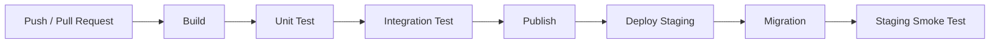
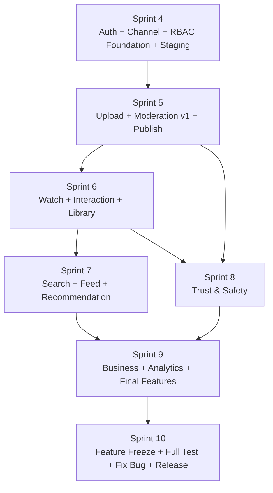

# PLAN.md — Kế hoạch tổng quan phát triển HuTube

> **Mốc hiện tại:** Bắt đầu Sprint 4/12.  
> **Mục tiêu:** Hoàn thành toàn bộ chức năng đã chốt trong Module 2.1, 2.2 và 2.3 chậm nhất vào cuối Sprint 9.  
> **Sprint 10 trở đi:** Feature Freeze; tập trung Fix Bug, Regression, E2E, Security, Performance, UAT, tài liệu và Production Release.
>
> Tài liệu này chỉ mô tả **roadmap tổng quan**. Chi tiết công việc, dependency, test case và tiêu chí hoàn thành của từng Sprint nằm trong:
>
> - `Sprint4.md`
> - `Sprint5.md`
> - `Sprint6.md`
> - `Sprint7.md`
> - `Sprint8.md`
> - `Sprint9.md`

---

## 1. Tài liệu nguồn

Kế hoạch được chia từ ba nhóm chức năng đã chốt:

- **Module 2.1 — Recommendation:** Model-Based Collaborative Filtering, MBMF, interaction dataset, benchmark, training/inference, model management.
- **Module 2.2 — Web Quản trị:** RBAC, User/Channel/Video/Comment management, moderation, report, strike, appeal, plan, payment, analytics, audit, system settings.
- **Module 2.3 — Web User + Mobile User:** Auth, Channel, Creator Studio, Upload, Player, Interaction, Search, Feed, Library, Community, Report, Copyright, Payment, Analytics, HuAI và các chức năng Mobile.

---

# 2. Nguyên tắc phát triển

## 2.1. Phát triển theo Use Case nghiệp vụ / Vertical Slice

Không phát triển theo thứ tự:

```text
Làm hết Web User
→ làm hết Mobile
→ làm hết Admin
→ làm hết Backend
→ cuối cùng mới tích hợp
```

Mỗi nghiệp vụ phải được làm xuyên suốt:

```text
Business Rule
    ↓
Database / Migration
    ↓
Backend API
    ↓
Unit Test
    ↓
Integration Test
    ↓
Deploy Backend Staging
    ↓
Web / Mobile / Admin tích hợp API thật
    ↓
E2E Smoke
    ↓
Done
```

Ví dụ:

```text
Nghiệp vụ phát hành Video

Creator Upload
→ Storage
→ Processing
→ Metadata
→ Moderation
→ Admin Approve/Reject
→ Notification
→ Published
```

Nghiệp vụ này được xem là một Vertical Slice dù nó đi xuyên Module Người dùng, Backend và Module Quản trị.

---

## 2.2. Làm luôn các chức năng con trực tiếp của nghiệp vụ

Khi triển khai một nghiệp vụ, các chức năng nhỏ trực tiếp thuộc lifecycle của nghiệp vụ đó phải được hoàn thiện cùng đợt.

Ví dụ Upload Video phải xử lý cùng:

- Thumbnail.
- Title.
- Description.
- Playlist.
- Category/Topic.
- Tag.
- Visibility.
- Schedule.
- Preview.
- Upload Retry/Cancel.
- Processing State.
- Moderation State.

Không để các chức năng này thành “việc nhỏ làm sau” nếu việc bỏ chúng khiến schema/API/UI phải sửa lại.

---

# 3. Deploy-first từ Sprint 4

## 3.1. Backend Staging là môi trường tích hợp chính

Ngay Sprint 4 phải có:

```text
Development Local
       ↓
Staging
       ↓
Production
```

Trong đó:

- **Local:** debug và chạy test cô lập.
- **Staging:** Web User, Mobile User và Web Admin gọi API thật hằng ngày.
- **Production:** chỉ dùng khi bước vào giai đoạn Release.

Frontend không hard-code:

```text
http://localhost:xxxx
```

Mà sử dụng:

```text
API_BASE_URL
```

theo Environment.

---

## 3.2. CI/CD tối thiểu



Không Deploy nếu:

- Build fail.
- Unit Test fail.
- Integration Test fail.
- Migration fail.
- Smoke Test tối thiểu fail.

---

# 4. Chính sách Test

## 4.1. Unit Test

Viết song song với code, không để Sprint 10 mới bổ sung.

Ưu tiên:

- Business Rule.
- Validation.
- State transition.
- Permission.
- Mapping/Calculation quan trọng.
- Recommendation preprocessing/model logic.

---

## 4.2. Integration Test

Viết song song khi xây API/Infrastructure.

Luồng tối thiểu:

```text
HTTP/API
→ Application
→ Infrastructure
→ Database
```

Phải kiểm tra:

- Success.
- Validation.
- 401.
- 403.
- 404.
- Conflict.
- Soft Delete.
- Transaction.
- Pagination/Cursor.
- External Service failure nếu có.

---

## 4.3. E2E Smoke trong từng Sprint

Mỗi Vertical Slice chính phải có E2E Smoke ngay trong Sprint đó.

Không cần chạy toàn bộ Regression mỗi ngày, nhưng Happy Path quan trọng phải đi xuyên:

```text
Frontend
→ Staging API
→ Database / Storage / External Service
→ Frontend
```

---

## 4.4. Full E2E / Regression

Được đẩy mạnh ở Sprint 10 sau Feature Freeze.

Các journey lớn phải đã có smoke test từ Sprint 4–9, Sprint 10 chỉ gom và mở rộng thành Regression Suite.

---

# 5. Roadmap Sprint 4 → Sprint 9

| Sprint | Nghiệp vụ chính | Gate cuối Sprint |
|---|---|---|
| **Sprint 4** | Foundation + Staging + Auth + Account + Channel + Channel Permission + **RBAC Foundation** | Ba Frontend gọi được Staging; Auth/Channel/RBAC nền chạy |
| **Sprint 5** | Upload + Video Processing + Taxonomy + Moderation v1 + Publish + Notification v1 | Creator Upload → Admin duyệt → Video Published |
| **Sprint 6** | Player + Watch Tracking + Interaction + Comment + Subscribe + Library + Community | Có Interaction Dataset thật phục vụ Recommendation |
| **Sprint 7** | Search + Explore + Home Feed + MBMF Recommendation + Python Service + Admin Recommendation | Personalized Feed/Fallback chạy qua .NET Backend |
| **Sprint 8** | Report + Moderation v2 + Policy + Strike + Appeal + Copyright + Admin Content Management | Report → xử lý → Strike → Appeal chạy End-to-End |
| **Sprint 9** | Plan + Subscription + Payment + Analytics + RBAC Management đầy đủ + Notification + Settings + Privacy + HuAI + Finishing | **FEATURE COMPLETE / FEATURE FREEZE** |

---

# 6. Dependency tổng quát



---

# 7. Phạm vi từng Sprint

## Sprint 4 — Foundation

Mục tiêu:

- Backend Staging.
- CI/CD.
- Auth + Session.
- Account/Profile.
- Channel.
- Channel Member/Role.
- **RBAC Foundation cho Web Admin.**

RBAC Foundation gồm:

- Admin Access.
- Role.
- Permission.
- AdminRole/UserRole.
- RolePermission.
- Seed Role.
- Seed Permission cần cho Sprint 4–5.
- Permission middleware/policy.
- 401/403.
- Menu Admin theo Permission.
- Không yêu cầu UI quản trị Role/Permission hoàn chỉnh ở Sprint 4.

Chi tiết: `Sprint4.md`.

---

## Sprint 5 — Video Publishing

Mục tiêu:

- Upload Web/Mobile.
- Storage.
- Processing.
- Metadata.
- Playlist/Category/Tag.
- Visibility.
- Schedule.
- Moderation v1.
- Approve/Reject.
- Creator Video Management.
- Notification v1.

Chi tiết: `Sprint5.md`.

---

## Sprint 6 — Consumption & Interaction

Mục tiêu:

- Video Player.
- Watch History/Resume.
- Interaction Event.
- Like/Dislike.
- Share.
- Comment.
- Subscribe.
- Playlist.
- Watch Later.
- Download.
- Community moderation.
- Dataset đủ cấu trúc cho Recommendation.

Chi tiết: `Sprint6.md`.

---

## Sprint 7 — Discovery & Recommendation

Mục tiêu:

- Search.
- Explore.
- Trending/Popular/New.
- Home Feed.
- MovieLens benchmark.
- HuTube training snapshot.
- BOT/REAL data.
- MBMF.
- Evaluation.
- Recommendation Service Python.
- .NET Integration.
- Cold-start fallback.
- Admin Recommendation Management.

Chi tiết: `Sprint7.md`.

---

## Sprint 8 — Trust & Safety

Mục tiêu:

- Report.
- Group Report Case.
- Moderation v2.
- Policy/Policy Version.
- Warning/Strike.
- Suspend/Ban.
- Appeal.
- Copyright.
- Admin User/Channel/Video/Comment management.
- Audit mở rộng.

Chi tiết: `Sprint8.md`.

---

## Sprint 9 — Business & Completion

Mục tiêu:

- Plan.
- Subscription.
- Payment.
- Refund/Revenue.
- Creator Analytics.
- Admin Dashboard/Analytics.
- RBAC Management đầy đủ.
- Admin Account Management.
- Notification Template.
- System Settings.
- Privacy/Session/Delete.
- HuAI.
- Mobile/Web/Admin finishing.
- Feature Freeze.

Chi tiết: `Sprint9.md`.

---

# 8. Definition of Done cho một Task

Một task chỉ được chuyển sang Done khi phù hợp với loại task và đã đạt:

- [ ] Business Rule đã rõ.
- [ ] Code hoàn tất.
- [ ] Validation đầy đủ.
- [ ] Permission đầy đủ.
- [ ] Migration có nếu thay DB.
- [ ] Unit Test pass.
- [ ] Integration Test pass nếu liên quan API/DB.
- [ ] OpenAPI/Swagger cập nhật.
- [ ] Backend đã có trên Staging.
- [ ] Frontend liên quan gọi API Staging.
- [ ] Loading/Empty/Error state có.
- [ ] 401/403 được xử lý.
- [ ] Logging phù hợp.
- [ ] Không lộ Secret/Credential.
- [ ] Không còn Blocker/Critical.
- [ ] PR Review hoàn tất.

---

# 9. Definition of Done cho một Use Case nghiệp vụ

Một Use Case chỉ được Done khi toàn bộ luồng chạy được.

Ví dụ:

```text
Upload Video
```

không thể Done chỉ vì API upload chạy.

Phải đạt:

```text
Creator chọn file
→ Validate
→ Upload
→ Processing
→ Metadata
→ Category/Tag/Playlist
→ Visibility
→ Submit
→ Moderator nhận Queue
→ Review
→ Approve/Reject
→ Notification
→ User UI hiển thị đúng trạng thái
→ Unit Test
→ Integration Test
→ E2E Smoke trên Staging
```

---

# 10. Sprint Gate

## Cuối Sprint 4

```text
STAGING READY
+
AUTH READY
+
CHANNEL READY
+
RBAC FOUNDATION READY
```

## Cuối Sprint 5

```text
UPLOAD → MODERATION → PUBLISH READY
```

## Cuối Sprint 6

```text
WATCH → INTERACTION → TRAINING DATA READY
```

## Cuối Sprint 7

```text
SEARCH + FEED + RECOMMENDATION READY
```

## Cuối Sprint 8

```text
REPORT → ENFORCEMENT → APPEAL READY
```

## Cuối Sprint 9

```text
FEATURE COMPLETE
```

---

# 11. Quy tắc Feature Freeze

Sau cuối Sprint 9:

### Cho phép

- Fix Bug.
- Regression.
- E2E.
- Security Fix.
- Performance Fix.
- UX polish.
- Logging.
- Monitoring.
- Documentation.
- Deployment.

### Không cho phép

- Thêm nghiệp vụ lớn mới.
- Rewrite Architecture.
- Đổi Framework.
- Đổi Database không cần thiết.
- Thêm tính năng ngoài scope làm ảnh hưởng Release.

---

# 12. Sprint 10–12

## Sprint 10

- Full Regression.
- Full E2E.
- Security Test.
- Performance Test.
- Fix Bug.
- Release Candidate.
- Production Deploy.

## Sprint 11

- UAT.
- Optimize.
- Compatibility.
- Accessibility.
- Documentation.
- Monitoring.
- Backup/Restore verification.
- Báo cáo test/KLCN.

## Sprint 12

- Final Regression.
- Final Release.
- Fix lỗi còn lại.
- Demo.
- KLCN/Defense.
- Buffer cho sự cố cuối kỳ.

---

# 13. Tài liệu Sprint chi tiết

| File | Nội dung |
|---|---|
| `Sprint4.md` | Staging, Auth, Account, Channel, RBAC Foundation |
| `Sprint5.md` | Upload, Processing, Taxonomy, Moderation v1, Publish |
| `Sprint6.md` | Player, Interaction, Community, Library |
| `Sprint7.md` | Search, Explore, Feed, MBMF Recommendation |
| `Sprint8.md` | Report, Moderation v2, Policy, Strike, Appeal, Copyright |
| `Sprint9.md` | Plan, Payment, Analytics, RBAC Full, Settings, HuAI, Freeze |

> Các file Sprint là tài liệu thực thi; `PLAN.md` chỉ dùng làm roadmap cấp dự án.
