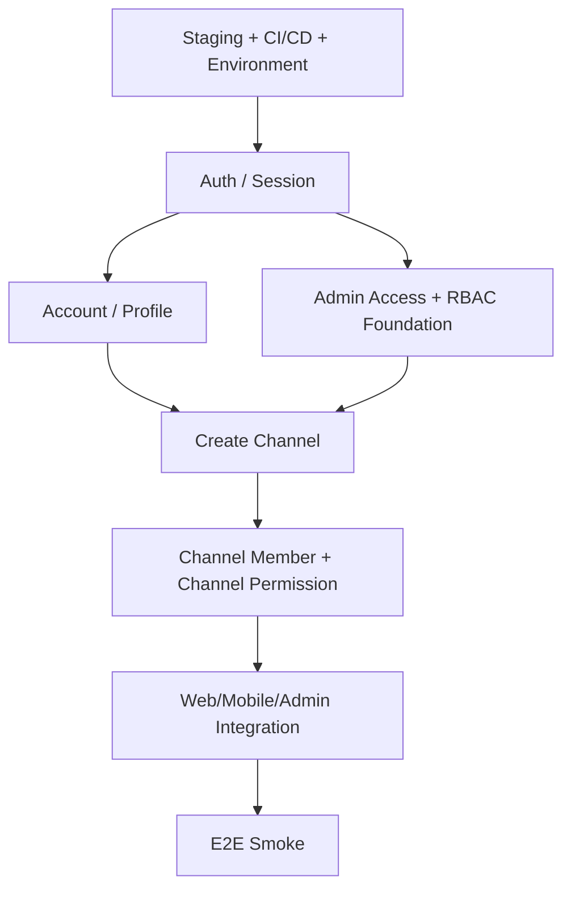

# Sprint4.md — Foundation, Staging, Auth, Channel và RBAC Foundation

> **Mục tiêu Sprint:** Tạo nền móng có thể dùng thật cho toàn bộ Sprint sau.  
> Kết thúc Sprint 4, Web User, Mobile User và Web Admin phải gọi được **Backend Staging cố định**; Auth, Account, Channel và RBAC Foundation phải chạy End-to-End.

---

# 1. Sprint Goal

```text
Deploy-first Foundation
      +
Auth / Session
      +
Account
      +
Channel
      +
Channel Member Permission
      +
Admin RBAC Foundation
```

### Sprint Gate

```text
Frontend Web
Frontend Mobile
Admin Web
      ↓
STAGING API
      ↓
Cloud/Test Database
```

Không còn tình trạng chỉ demo bằng Backend Local cho các luồng chính.

---

# 2. Dependency và thứ tự thực hiện



Thứ tự ưu tiên:

1. Hạ tầng Staging.
2. Auth/Session.
3. Admin Access + RBAC Foundation.
4. Account/Profile.
5. Channel.
6. Channel Member/Permission.
7. Web/Mobile/Admin integration.
8. E2E Smoke + Sprint hardening.

---

# 3. Vertical Slice S4-01 — Hạ tầng Staging và API Foundation

## 3.1. Backend

Phải có:

- Environment:
  - Development.
  - Staging.
  - Production.
- Environment Variable.
- Database connection theo môi trường.
- Storage config placeholder/credential nếu Sprint 5 dùng.
- JWT/Auth config.
- CORS.
- Logging.
- Global Exception Handler.
- Request Validation.
- Swagger/OpenAPI.
- Health Check.
- Standard Error Response.
- Pagination convention.
- Soft Delete convention.
- Timezone/UTC convention.
- Migration strategy.

## 3.2. Frontend configuration

Ba Frontend không hard-code API URL.

Cấu hình:

```text
Web User
  API_BASE_URL

Mobile
  API_BASE_URL

Web Admin
  API_BASE_URL
```

Development có thể override Local, nhưng branch tích hợp dùng Staging.

## 3.3. CI/CD

Pipeline tối thiểu:

```text
Build
→ Unit Test
→ Integration Test
→ Publish
→ Deploy Staging
→ Run Migration
→ Smoke /health
```

## 3.4. Deliverable

- Backend Staging URL.
- Swagger Staging.
- Health endpoint.
- Migration chạy được.
- Một endpoint test được gọi từ cả 3 Frontend.

---

# 4. Vertical Slice S4-02 — Đăng ký, đăng nhập và quản lý phiên

## 4.1. User flow

```text
Register
→ Verify Email
→ Login
→ Nhận Session/Token
→ Access Protected API
→ Refresh
→ Logout
```

## 4.2. Chức năng

- Register.
- Login.
- Logout.
- Refresh Token.
- Verify Email.
- Resend Verification nếu scope có.
- Forgot Password.
- Reset Password.
- Session restore.
- Logout current session.
- Logout other sessions.
- Account status check.
- Suspended/Banned user bị chặn.
- External Login nếu đã chốt trong scope:
  - Google.
  - Facebook.

## 4.3. Web User

- Register page.
- Login page.
- Verify state.
- Forgot/Reset.
- Session expired.
- Redirect về màn hình trước sau Login khi phù hợp.

## 4.4. Mobile

- Login/Register.
- Deep Link sau Login.
- Secure token/session storage theo kiến trúc app.
- Session expired handling.
- Keyboard handling.
- Loading/Error.

## 4.5. Admin

- Admin Login dùng Auth chung hoặc cơ chế đã chốt.
- User thường không được truy cập Admin App.
- Disabled Admin bị chặn dù User Account vẫn còn hoạt động.

---

# 5. Vertical Slice S4-03 — Account/Profile/Settings nền

## 5.1. Chức năng

- Avatar.
- Display Name.
- Email.
- Email verification status.
- Change Password.
- Language.
- Theme.
- Basic Notification Setting.
- Basic Privacy Setting.
- User ID.
- View active sessions.
- Logout other session.

## 5.2. Không làm sâu ở Sprint 4

Các phần dưới chỉ dựng nền, hoàn thiện ở Sprint 9:

- Delete Account workflow đầy đủ.
- Privacy/Data lifecycle đầy đủ.
- Notification Template.
- Plan/Payment settings.

---

# 6. Vertical Slice S4-04 — Tạo và quản lý Channel

## 6.1. Tạo Channel

Thông tin:

- Channel Name.
- Handle/Tag.
- Avatar.
- Banner.
- Description.
- Contact nếu có.
- Social Link nếu scope có.
- Created At.
- Owner.

Business Rule:

- Kiểm tra giới hạn Channel/User.
- Handle không trùng.
- Owner được tạo đúng quyền.
- User không đủ điều kiện bị từ chối đúng lỗi.

## 6.2. Tùy chỉnh Channel

- Edit Name.
- Edit Handle theo rule.
- Avatar.
- Banner.
- Description.
- Contact.
- Branding.
- Watermark.
- Channel home configuration nền.

## 6.3. Channel state

Chuẩn hóa tối thiểu:

```text
Active
Suspended
Banned
Deleted
```

Sprint 4 chỉ cần nền; enforcement sâu ở Sprint 8.

## 6.4. Delete Channel nền

Chưa cần workflow hoàn chỉnh như Sprint 9, nhưng phải chốt rule:

- Chỉ Owner.
- Không Hard Delete trực tiếp.
- Có Soft Delete model.
- API/DB không để member thường xóa.

---

# 7. Vertical Slice S4-05 — Thành viên và quyền Channel

## 7.1. Role Channel

- Owner.
- Manager.
- Editor.
- Moderator.
- Viewer.

## 7.2. Invitation

State đề xuất theo module:

```text
Pending
Accepted
Declined
Expired
Revoked
```

## 7.3. Chức năng

- Invite Member.
- View Invitation.
- Accept.
- Decline.
- Revoke.
- List Member.
- Change Role.
- Remove Member.

## 7.4. Permission rule

Ví dụ:

- Owner:
  - full channel authority.
- Manager:
  - content/channel management theo permission.
- Editor:
  - upload/edit content.
- Moderator:
  - community/comment.
- Viewer:
  - read-only nội bộ được cấp.

API phải kiểm tra permission, không chỉ ẩn nút UI.

---

# 8. Vertical Slice S4-06 — RBAC Foundation cho Web Admin

> Đây là phần bắt buộc của Sprint 4, không để sang Sprint 9.

## 8.1. Mục tiêu

Sprint 4 không cần UI quản trị Role/Permission hoàn chỉnh, nhưng phải có **RBAC Engine** để tất cả nghiệp vụ Admin từ Sprint 5 trở đi kiểm tra quyền được.

```text
Admin Request
   ↓
Authentication
   ↓
Admin Access
   ↓
Role
   ↓
Permission
   ↓
Business Rule
   ↓
Action
```

## 8.2. Thành phần dữ liệu cần có

Tối thiểu:

- Admin Access/Admin Account.
- Role.
- Permission.
- AdminRole/UserRole.
- RolePermission.

Nếu schema thực tế tổ chức khác thì vẫn phải thể hiện được quan hệ tương đương.

## 8.3. Seed Role tối thiểu

Sprint 4 seed:

- Super Admin.
- Administrator.
- Moderator.

Có thể seed sẵn:

- Support.
- Finance.
- Analyst.
- Auditor.

nhưng chưa bắt buộc UI quản lý đầy đủ.

## 8.4. Seed Permission tối thiểu

Cần ít nhất các quyền phục vụ Sprint 4–5:

```text
dashboard.view

user.view

channel.view
channel.edit

video.view

moderation.view_queue
moderation.claim
moderation.review
moderation.approve
moderation.reject

audit.view
```

Nếu dùng permission code chi tiết hơn thì giữ convention của Module Quản trị.

## 8.5. Backend enforcement

Phải có cơ chế tương đương:

```text
RequirePermission("moderation.approve")
```

Kiểm tra:

- User chưa Login → 401.
- User Login nhưng không phải Admin → 403.
- Admin không có Permission → 403.
- Admin có Permission → tiếp tục Business Rule.
- Disabled Admin → 403/blocked theo convention.

## 8.6. Admin Web

- Admin Login.
- Admin shell/layout.
- Sidebar render theo Permission.
- Không hiển thị menu không có quyền.
- No Permission page.
- Không coi “ẩn nút” là bảo mật; API vẫn phải check.

## 8.7. Audit nền

Sprint 4 ghi tối thiểu:

- Admin Login.
- Admin Logout.
- Failed Login nếu có.
- Permission denied có thể log security event.
- Channel/Admin action quan trọng.

Audit đầy đủ mở rộng Sprint 8–9.

---

# 9. Database/Migration checklist Sprint 4

Phải rà soát model cho:

- User.
- Auth identity.
- Email verification.
- Session/Refresh token model.
- Channel.
- Channel member.
- Channel invitation.
- Channel role/permission nếu dùng.
- Admin access.
- Role.
- Permission.
- Role assignment.
- RolePermission.
- Soft delete fields cần thiết.
- Audit nền.

Migration:

- Có up/down hoặc rollback strategy theo quy ước dự án.
- Không chỉnh trực tiếp DB Staging bằng tay nếu thay đổi schema có thể biểu diễn bằng migration.

---

# 10. API Contract checklist Sprint 4

Mỗi nhóm API phải chốt:

- Method.
- Route.
- Auth requirement.
- Permission.
- Request DTO.
- Response DTO.
- Validation.
- Error code.
- HTTP status.
- Idempotency nếu có.
- Pagination nếu list.

Nhóm API:

- Auth.
- Session.
- Account/Profile.
- Channel.
- Channel Member/Invitation.
- Admin Auth/Access.
- Role/Permission read foundation.

---

# 11. Unit Test Sprint 4

## 11.1. Auth

Phải có case:

- Email hợp lệ/không hợp lệ.
- Duplicate email.
- Password rule.
- Login đúng.
- Login sai password.
- User chưa verify nếu policy yêu cầu.
- User Suspended.
- User Banned.
- Refresh token hợp lệ.
- Refresh token hết hạn.
- Refresh token revoked.
- Logout revoke session.

## 11.2. Channel

- User được tạo Channel.
- Vượt Channel limit.
- Handle trùng.
- Update hợp lệ.
- Member không đủ quyền chỉnh Channel.
- Owner có quyền.
- Soft Delete state.

## 11.3. Channel Permission

- Owner full permission.
- Manager permission đúng.
- Editor không có quyền Owner-only.
- Moderator không mặc định được edit Video/Settings.
- Viewer read-only.
- Invitation state transition hợp lệ.
- Invitation đã revoked không accept được.

## 11.4. RBAC

- User thường không có Admin Access.
- Disabled Admin bị chặn.
- Admin có Role được resolve Permission.
- Admin nhiều Role nhận union Permission nếu thiết kế như vậy.
- Permission không tồn tại → deny.
- Super Admin rule đúng.
- Admin không được tự vượt quyền theo Business Rule.

---

# 12. Integration Test Sprint 4

## INT-S4-01 Register → DB

**Steps**

1. POST Register.
2. Kiểm tra User được tạo.
3. Kiểm tra verification state.
4. Kiểm tra duplicate register.

**Expected**

- User duy nhất.
- Không lưu password dạng rõ.
- Duplicate trả lỗi đúng contract.

## INT-S4-02 Login → Protected API

1. Register/Seed User.
2. Login.
3. Gọi Protected API.
4. Refresh.
5. Logout.
6. Gọi lại bằng session/token đã revoke.

**Expected**

- Trước logout truy cập được.
- Sau revoke bị từ chối.

## INT-S4-03 Admin RBAC

1. Seed Moderator.
2. Gán `moderation.view_queue`.
3. Không gán `moderation.approve`.
4. Gọi API Queue.
5. Gọi API Approve stub/protected action.

**Expected**

- Queue allowed.
- Approve forbidden.

## INT-S4-04 Channel Membership

1. Owner tạo Channel.
2. Invite Editor.
3. Editor Accept.
4. Editor gọi API được phép.
5. Editor gọi Owner-only API.

**Expected**

- Permission đúng ở API và DB.

---

# 13. E2E Sprint 4 — mô tả chi tiết

## E2E-S4-01 — Register → Verify → Login

### Preconditions

- Staging hoạt động.
- Test email có thể nhận/giả lập verification theo môi trường.

### Steps

1. Mở Web/Mobile Register.
2. Nhập tài khoản mới.
3. Submit.
4. Thực hiện Verify.
5. Login.
6. Mở Account/Profile.
7. Refresh app/page.
8. Kiểm tra session được khôi phục.

### Expected

- Register thành công.
- Verify state đúng.
- Login thành công.
- Protected screen truy cập được.
- Refresh không làm mất session hợp lệ.

---

## E2E-S4-02 — User thường không vào được Web Admin

### Preconditions

- Có User thường.
- Không có Admin Access.

### Steps

1. Login User.
2. Truy cập Admin URL.
3. Thử gọi một Admin API trực tiếp.

### Expected

- UI không cho vào.
- API trả 403/đúng security contract.
- Không có dữ liệu Admin bị lộ.

---

## E2E-S4-03 — Moderator chỉ thấy menu được phép

### Preconditions

- Moderator có một tập Permission giới hạn.

### Steps

1. Login Admin.
2. Quan sát Sidebar.
3. Mở menu được phép.
4. Thử deep-link URL của màn hình không có Permission.
5. Thử gọi API tương ứng.

### Expected

- Sidebar chỉ render chức năng được phép.
- Deep-link bị No Permission.
- API vẫn trả Forbidden.

---

## E2E-S4-04 — Tạo và tùy chỉnh Channel

### Steps

1. User Login.
2. Chọn Create Channel.
3. Nhập tên/handle.
4. Upload Avatar/Banner nếu hỗ trợ ngay.
5. Save.
6. Mở Channel Detail.
7. Edit Description/Branding.
8. Refresh.

### Expected

- Channel tồn tại.
- Owner đúng.
- Handle đúng rule.
- Data persist sau refresh.
- Web và Mobile hiển thị cùng dữ liệu.

---

## E2E-S4-05 — Invite Editor

### Steps

1. Owner mở Member Management.
2. Invite User B với role Editor.
3. User B nhận/mở invitation.
4. Accept.
5. User B vào Creator Studio.
6. Thử chức năng Editor được phép.
7. Thử xóa Channel.

### Expected

- Editor có access đúng phạm vi.
- Delete Channel bị chặn.
- Permission được enforce từ Backend.

---

## E2E-S4-06 — Backend Staging contract

### Steps

1. Web gọi API Staging.
2. Mobile gọi cùng API.
3. Admin gọi Admin API.
4. Deploy Backend version mới tương thích.
5. Chạy lại smoke.

### Expected

- Cả ba client dùng cùng Base URL.
- Không cần đổi code source chỉ để đổi host.
- Swagger contract khớp.

---

# 14. Sprint 4 Exit Criteria

- [ ] Backend Staging hoạt động.
- [ ] CI/CD có Build + Unit + Integration + Deploy.
- [ ] Swagger Staging.
- [ ] Web/Mobile/Admin gọi Staging.
- [ ] Auth/Session Done.
- [ ] Account/Profile nền Done.
- [ ] Channel Done.
- [ ] Channel Member/Invitation Done.
- [ ] RBAC Foundation Done.
- [ ] Admin Shell kiểm tra Permission.
- [ ] Unit Test pass.
- [ ] Integration Test pass.
- [ ] 6 E2E Smoke trên Staging pass.
- [ ] Không còn Blocker/Critical chuyển sang Sprint 5.

---

# 15. Không được dời sang Sprint 5

Không dời:

- Staging.
- Auth foundation.
- Channel owner/member permission.
- RBAC permission enforcement.
- Admin Login/Access.
- 401/403 handling.

Vì Sprint 5 Moderation phụ thuộc trực tiếp vào các nền tảng này.
