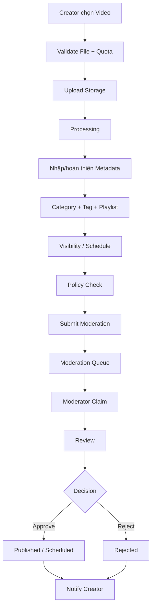

# Sprint5.md — Upload, Processing, Moderation v1 và Publish Video

> **Sprint Goal:** Hoàn thiện toàn bộ nghiệp vụ **Đăng tải và phát hành Video** xuyên Web User, Mobile User, Backend, Storage và Web Admin.

---

# 1. Luồng nghiệp vụ mục tiêu



Sprint 5 chỉ Done khi luồng trên chạy trên **Staging**.

---

# 2. Dependency

Yêu cầu Sprint 4:

- Auth.
- Channel.
- Channel Member Permission.
- Admin Access.
- RBAC Foundation.
- Backend Staging.

Permission tối thiểu cho Moderator phải hoạt động trước khi làm Moderation Queue.

---

# 3. Vertical Slice S5-01 — Upload File

## 3.1. Web

- File Picker.
- Drag & Drop.
- Validate trước upload.
- Progress.
- Cancel.
- Retry.
- Error State.

## 3.2. Mobile

- Photo/Video/File Picker.
- Xin Permission đúng thời điểm.
- Preview file.
- Progress.
- Cancel.
- Retry khi mạng lỗi.
- Giữ Draft nếu phù hợp.

## 3.3. Backend

Kiểm tra:

- User có Channel.
- User có quyền Upload trong Channel.
- File type.
- File size.
- Storage quota.
- Trạng thái Channel.
- Upload state.

## 3.4. State

Tối thiểu:

```text
Draft
Uploading
Processing
Checking
Ready
Failed
Cancelled
```

---

# 4. Vertical Slice S5-02 — Video Metadata

Phải hoàn thiện cùng Upload:

- Title.
- Description.
- Thumbnail.
- Auto-generated thumbnail nếu pipeline hỗ trợ.
- Custom thumbnail.
- Playlist.
- Category/Topic.
- Tag.
- Language.
- Audience.
- Age Restriction nếu scope có.

Validation:

- Required field.
- Max length.
- Tag count/format.
- Category hợp lệ.
- Playlist thuộc Channel/User phù hợp.
- Thumbnail type/size.

---

# 5. Vertical Slice S5-03 — Thành phần Video

Theo scope Module Người dùng:

- Video Card.
- Poll/Quiz.
- End Screen nếu đã chốt.
- Subtitle nếu đã chốt.
- Chapter nếu đã chốt.

Quy tắc:

- Thành phần có timestamp phải nằm trong duration.
- Không tham chiếu Video/Playlist không được phép.
- Edit được trước Publish.
- Nếu Edit sau Publish phải theo Business Rule đã chốt.

---

# 6. Vertical Slice S5-04 — Taxonomy

Vì Upload phụ thuộc Category/Tag nên Admin phải có tối thiểu:

## Category/Topic

- List.
- Create.
- Edit.
- Enable/Disable.
- Soft Delete.
- Sort/order nếu dùng.

## Tag

- List.
- Search.
- Create/normalize nếu business model cho phép.
- Rename.
- Disable.
- Merge Tag nếu scope có.
- Soft Delete.

Video API phải dùng Category/Tag hợp lệ.

---

# 7. Vertical Slice S5-05 — Visibility và Schedule

Trạng thái hiển thị:

```text
Public
Private
Unlisted
Scheduled
```

Business Rule:

### Public

- Chỉ public sau khi đạt điều kiện Publish/Moderation.

### Private

- Không xuất hiện Search/Recommendation.
- Chỉ Owner/người được phép xem.

### Unlisted

- Không xuất hiện bình thường trong Search/Recommendation.
- Người có URL xem được theo rule.

### Scheduled

- Có publish time.
- Không public trước thời điểm.
- Khi tới thời điểm phải chuyển đúng state nếu đã được duyệt.

---

# 8. Vertical Slice S5-06 — Processing

Infrastructure cần xử lý:

- Duration.
- Basic media metadata.
- Thumbnail.
- Processing status.
- Failure reason.
- Retry strategy.
- Cleanup file lỗi nếu cần.
- Quota update/rollback hợp lý.

Không cho Publish nếu:

- File chưa upload xong.
- Processing Failed.
- Video chưa đạt các điều kiện bắt buộc.

---

# 9. Vertical Slice S5-07 — Moderation v1

## 9.1. Queue

Admin thấy:

- Video.
- Thumbnail.
- Creator/Channel.
- Created time.
- Queue time.
- Category.
- Tag.
- Current state.

FIFO mặc định.

## 9.2. Claim Case

Mục tiêu tránh hai Moderator xử lý cùng một case.

State tối thiểu:

```text
Pending
InReview
Approved
Rejected
Escalated
```

## 9.3. Review

Moderator:

- Preview Video.
- Xem Metadata.
- Xem Channel.
- Xem Policy hiện hành.
- Chọn Policy vi phạm nếu Reject.
- Internal Note.
- Approve.
- Reject.
- Escalate nền.

## 9.4. Permission

Tối thiểu:

```text
moderation.view_queue
moderation.claim
moderation.review
moderation.approve
moderation.reject
```

API phải check RBAC Foundation từ Sprint 4.

---

# 10. Vertical Slice S5-08 — Notification v1

Creator nhận:

- Upload completed nếu cần.
- Processing failed.
- Submitted.
- Approved.
- Rejected.
- Scheduled published.

Kênh:

- In-app.
- Email theo setting cơ bản.

Notification phải deep-link được về:

- Video detail.
- Creator Studio content.
- Moderation reason nếu Creator được xem.

---

# 11. Vertical Slice S5-09 — Creator Video Management

Creator Studio > Nội dung:

- List Video.
- Search.
- Filter.
- Sort.
- State.
- Visibility.
- Restriction.
- Edit Metadata.
- Change Visibility.
- Schedule.
- Copy URL.
- Delete/Soft Delete.
- Bulk action phù hợp.
- Open Analytics placeholder được phép nhưng Analytics thật Sprint 9.

Mobile:

- List 1 cột.
- Bottom Sheet.
- Long Press Select Mode.

---

# 12. Database/Migration Sprint 5

Rà soát model cho:

- Video.
- Video file/storage metadata.
- Upload state.
- Processing state.
- Visibility.
- Scheduled publish.
- Thumbnail.
- Category.
- Tag.
- VideoTag.
- Playlist relation cần cho Upload.
- Video Card/Quiz/Poll nếu có.
- Moderation Case.
- Moderation decision/history.
- Policy reference tối thiểu.
- Notification.

Không hard-delete Video quan trọng nếu hệ thống cần phục hồi/audit.

---

# 13. Unit Test Sprint 5

## Upload

- File type hợp lệ.
- File type sai.
- File vượt size.
- Quota đủ.
- Quota thiếu.
- Channel Suspended.
- User không có Upload permission.
- Cancel state.
- Retry state.

## Metadata

- Title required.
- Max length.
- Category invalid.
- Tag normalize.
- Thumbnail invalid.
- Playlist không thuộc phạm vi được phép.

## Visibility

- Public hợp lệ.
- Private.
- Unlisted.
- Scheduled time trong quá khứ.
- Scheduled time hợp lệ.
- Private không public ngoài ý muốn.

## Processing

- Processing success.
- Failure.
- Retry.
- Ready chỉ khi đủ điều kiện.

## Moderation

- Pending → InReview.
- InReview → Approved.
- InReview → Rejected.
- Reject bắt buộc reason/policy nếu rule yêu cầu.
- Moderator thiếu permission.
- Case đã được claim.
- Duplicate decision.
- Escalate.

---

# 14. Integration Test Sprint 5

## INT-S5-01 Upload → Storage → DB

1. Creator hợp lệ upload file.
2. File được Storage nhận.
3. DB có Video/Upload record.
4. Processing state thay đổi.
5. Metadata được persist.

Expected:

- Không có record “Published” trước khi đủ điều kiện.

## INT-S5-02 Quota fail

1. Seed Channel gần hết quota.
2. Upload file vượt quota.

Expected:

- Request bị reject.
- Không để orphan file hoặc quota sai.

## INT-S5-03 Submit Moderation

1. Video Ready.
2. Creator Submit.
3. Moderation Case được tạo.

Expected:

- Queue thấy đúng Video.
- Duplicate submit không tạo case trùng ngoài Business Rule.

## INT-S5-04 Approve

1. Moderator Claim.
2. Approve.
3. Video state cập nhật.
4. Notification được tạo.

Expected:

- Public Video truy cập được nếu Visibility Public.

## INT-S5-05 Reject

1. Moderator Review.
2. Chọn Policy/Reason.
3. Reject.

Expected:

- Video không public.
- Creator thấy lý do/trạng thái được phép.

---

# 15. E2E Sprint 5 — mô tả chi tiết

## E2E-S5-01 — Upload và Publish thành công

### Preconditions

- Creator có Channel Active.
- Có quota.
- Moderator có Permission.

### Steps

1. Creator Login Web.
2. Open Upload.
3. Chọn Video hợp lệ.
4. Theo dõi Progress.
5. Nhập Title/Description.
6. Chọn Thumbnail.
7. Chọn Category/Tag.
8. Add Playlist.
9. Chọn Public.
10. Submit.
11. Moderator Login Admin.
12. Open Queue.
13. Claim.
14. Preview.
15. Approve.
16. Creator nhận Notification.
17. Mở public URL bằng Guest.

### Expected

- State chuyển đúng từng bước.
- Guest xem được sau Approve/Publish.
- Metadata hiển thị đúng.
- Audit/Moderation history tồn tại.

---

## E2E-S5-02 — Mobile Upload mất mạng và Retry

1. Mobile chọn Video.
2. Bắt đầu Upload.
3. Mô phỏng mất mạng.
4. App hiển thị Failed/Paused theo thiết kế.
5. Có mạng lại.
6. Retry.
7. Hoàn tất metadata.
8. Submit.

Expected:

- Không tạo nhiều Video trùng.
- Không mất Draft quan trọng.
- Progress/state hợp lý.

---

## E2E-S5-03 — Reject Video

1. Creator Submit Video.
2. Moderator Claim.
3. Chọn Policy vi phạm.
4. Reject.
5. Creator mở Notification.
6. Creator mở Video detail.

Expected:

- Video không public.
- Lý do hiển thị đúng phạm vi.
- History ghi đúng Moderator/timestamp.

---

## E2E-S5-04 — Moderator không có approve permission

1. Login Admin chỉ có `moderation.view_queue`.
2. Mở Queue.
3. Mở case.
4. Thử Approve bằng UI/deep API.

Expected:

- Nút bị ẩn/disable phù hợp.
- API vẫn Forbidden.

---

## E2E-S5-05 — Private Video

1. Creator upload Video.
2. Chọn Private.
3. Hoàn tất processing/moderation nếu workflow yêu cầu.
4. Guest truy cập URL.
5. Owner truy cập URL.

Expected:

- Guest bị chặn.
- Owner xem được.
- Search không trả Video.

---

## E2E-S5-06 — Scheduled Video

1. Creator chọn Scheduled time tương lai.
2. Moderator Approve.
3. Trước thời điểm publish kiểm tra URL/Search.
4. Sau thời điểm publish kiểm tra lại.

Expected:

- Không public sớm.
- Đúng thời điểm chuyển state.
- Notification phù hợp.

---

# 16. Sprint 5 Exit Criteria

- [ ] Upload Web Done.
- [ ] Upload Mobile Done.
- [ ] Processing Done.
- [ ] Metadata Done.
- [ ] Category/Tag Done.
- [ ] Visibility/Schedule Done.
- [ ] Moderation v1 Done.
- [ ] Creator Video Management Done.
- [ ] Notification v1 Done.
- [ ] Unit Test pass.
- [ ] Integration Test pass.
- [ ] E2E upload→moderation→publish pass trên Staging.
- [ ] Không còn blocker khiến Sprint 6 không thể Watch Video.
