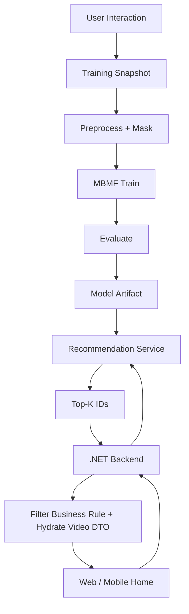

# Sprint7.md — Search, Explore, Home Feed và MBMF Recommendation

> **Sprint Goal:** Hoàn thiện Discovery và hệ gợi ý production của HuTube dựa trên dữ liệu Interaction từ Sprint 6.

---

# 1. Luồng tổng quát



Frontend không gọi trực tiếp Python Recommendation Service.

---

# 2. Vertical Slice S7-01 — Search

## Search target

- Video.
- Channel.
- Playlist.

## Chức năng

- Keyword.
- Autocomplete.
- Suggestion.
- Search History.
- Clear one.
- Clear all.
- Filter:
  - Date.
  - Views.
  - Duration.
  - Type.
  - Topic.
- Sort:
  - Relevance.
  - Latest.
  - Most viewed.
- Infinite Scroll/Cursor.

## Mobile

- Full-screen Search.
- Tab Video/Channel/Playlist.
- Filter Bottom Sheet.
- Giữ search state khi Back.

---

# 3. Vertical Slice S7-02 — Explore

- Topic.
- Trending.
- Popular.
- New Videos.
- High engagement nếu có.
- Filter.
- Sort.
- Infinite Scroll.

Cold-start Video dùng Explore/New/Trending để có traffic ban đầu.

---

# 4. Vertical Slice S7-03 — Home Feed Baseline

Trước khi model sẵn sàng:

```text
Fallback:
Trending
+ Popular
+ New Videos
+ Subscription
```

Home phải có:

- Infinite Scroll.
- Cursor.
- Loading.
- Retry.
- Empty.
- Not Interested.
- Don't Recommend Channel.
- Không hiển thị Deleted/Private/Hidden/Removed sai quyền.

Baseline phải hoạt động độc lập để khi Recommendation Service lỗi, Home vẫn dùng được.

---

# 5. Vertical Slice S7-04 — MovieLens Benchmark

Mục đích:

- Xác nhận pipeline MF/MBMF.
- Rating-only benchmark.
- Hyperparameter thử nghiệm.
- Metrics.

Không:

- Train production bằng MovieLens.
- Trộn MovieLens với HuTube production.

Output:

- Benchmark report.
- RMSE/MAE.
- Precision@K.
- Recall@K.
- NDCG@K.

---

# 6. Vertical Slice S7-05 — HuTube Training Dataset

Nguồn:

```text
BOT
+
REAL
```

Unified schema:

```text
user_id
item_id
rating
like
dislike
comment
share
watch_ratio
source
timestamp
```

## Missing semantics

Phân biệt:

```text
NULL = dataset không quan sát behavior
0    = behavior được quan sát nhưng không xảy ra
```

## Mask

- rating_mask.
- like_mask.
- dislike_mask.
- comment_mask.
- share_mask.
- watch_mask.

---

# 7. Vertical Slice S7-06 — Event Aggregation

Raw Event không đưa thẳng vào model.

Aggregate mỗi:

```text
(User, Video)
```

Quy tắc:

- rating = rating gần nhất.
- like/dislike = trạng thái hiện tại.
- comment = có ít nhất một comment hợp lệ.
- share = đã từng share.
- watch_ratio = giá trị aggregate đã chuẩn hóa/cap.

Phải test dữ liệu Removed/invalid theo rule training.

---

# 8. Vertical Slice S7-07 — BOT/Agent Synthetic Data

Agent có profile sở thích.

Không random hoàn toàn.

Ví dụ:

```text
Gaming     0.9
Football   0.7
Music      0.2
```

Profile ảnh hưởng xác suất:

- Watch.
- Watch Ratio.
- Rating.
- Like/Dislike.
- Comment.
- Share.

Ghi:

```text
source = BOT
```

User thật:

```text
source = REAL
```

BOT chỉ dùng bootstrap/testing/research; không tạo tương tác giả cho từng Video mới để ép Recommendation.

---

# 9. Vertical Slice S7-08 — Temporal Split

Không random split làm leakage nếu timeline là yếu tố chính.

Chốt:

```text
Train
Validation
Test
```

theo thời gian như Module_CF.

Kiểm tra:

- User/item encoding.
- Unknown/cold-start.
- Negative sampling.
- Không lấy positive item làm negative.

---

# 10. Vertical Slice S7-09 — MBMF

Model:

```text
Multi-Behavior Matrix Factorization
```

Shared:

- User Embedding.
- Video Embedding.

Behavior Head:

- Rating.
- Like.
- Dislike.
- Comment.
- Share.
- Watch.

Preference Head:

- sinh score cuối.
- dùng Top-K ranking.

Loss:

- Rating: Huber/MSE theo config.
- Like: BCE.
- Dislike: BCE.
- Comment: BCE.
- Share: BCE.
- Watch Ratio: Huber/MSE.
- Preference: ranking/BPR theo Module_CF.

Loss phải tôn trọng Mask.

---

# 11. Vertical Slice S7-10 — Evaluation

Ranking metric:

- NDCG@5/10/20.
- Recall@5/10/20.
- Precision@5/10/20.
- HitRate@K.

Primary Early Stopping:

```text
NDCG@10
```

Behavior metric:

- Rating RMSE/MAE.
- Binary metrics phù hợp.
- Watch Ratio error.

System metric:

- Coverage.
- Diversity.
- Novelty nếu đã chốt.
- Fallback Rate.
- Behavior Coverage.
- Cold-start rate.

---

# 12. Vertical Slice S7-11 — Model Artifact và Registry

Artifact cần:

- Model weights.
- User mapping.
- Video mapping.
- Config.
- Model version.
- Train time.
- Dataset metadata.
- Metrics.
- Seed.
- Model status.

Promote chỉ khi:

- Train success.
- Artifact valid.
- Metrics đạt gate.
- Inference smoke test pass.

Có Rollback.

---

# 13. Vertical Slice S7-12 — Recommendation Service Python

Trách nhiệm:

- Load model.
- Load mapping.
- Inference.
- Top-K.
- Health.
- Model reload/version.

Internal service:

- Không expose public nếu không cần.
- Dùng private network/service credential theo hạ tầng.

---

# 14. Vertical Slice S7-13 — .NET Integration

Frontend:

```text
GET Home/Recommendation API
```

.NET:

1. Auth/User context.
2. Gọi Python service.
3. Nhận Top-K ID + score.
4. Filter:
   - Deleted.
   - Private.
   - Hidden.
   - Removed.
   - Duplicate.
   - Content user không được xem.
5. Hydrate Video DTO.
6. Cursor/limit.
7. Fallback nếu Python fail.

---

# 15. Vertical Slice S7-14 — Cold Start

## User mới

Fallback:

- Trending.
- Popular.
- New.
- Subscription nếu đã Follow.

## Video mới

Traffic:

- Channel Page.
- Subscription.
- Search.
- Explore.
- New Video.
- Trending nếu đủ tín hiệu.

Sau khi có Interaction:

```text
Interaction
→ Snapshot
→ Retrain
→ Model học Video
```

---

# 16. Vertical Slice S7-15 — Admin Recommendation Management

Admin hiển thị:

- Current Model Version.
- Last Successful Train.
- Training Status.
- Dataset Size.
- BOT/REAL ratio.
- NDCG@10.
- Recall@10.
- Precision@10.
- RMSE.
- Behavior Coverage.
- Fallback Rate.

Action:

- Trigger Retrain.
- View History.
- Metrics/Charts.
- Model Metadata.
- Rollback.

Permission phải đi qua RBAC.

---

# 17. Deploy Sprint 7

Staging:

```text
Web/Mobile
   ↓
.NET Backend Staging
   ↓ internal
Recommendation Service Staging
   ↓
Model Artifact
```

Training Worker:

- Manual trigger được.
- Scheduled nếu có.
- Staging model tách Production.

Smoke sau Deploy:

- Health Python.
- Health .NET.
- Top-K.
- Fallback.

---

# 18. Unit Test Sprint 7

## Python — bắt buộc

- NULL → mask đúng.
- 0 không thành missing.
- Watch Ratio.
- Aggregate event.
- Like/Dislike mutual exclusion.
- User encoding.
- Video encoding.
- Temporal split không leakage.
- Loss bỏ qua mask=0.
- Loss đúng loại.
- Negative sampling không lấy positive.
- Forward shape/range.
- Preference score range.
- Top-K không duplicate.
- Save/Load model.
- Save/Load mapping.
- Seed reproducible.

## .NET

- Auth required.
- User hợp lệ.
- Python timeout → fallback.
- Python 5xx → fallback.
- Invalid schema → safe fallback/error.
- Deleted filtered.
- Private filtered.
- Hidden/Removed filtered.
- Duplicate filtered.
- Limit.
- Cursor.

## Search/Explore

- Filter.
- Visibility.
- Pagination.
- Empty.
- Search history privacy.

---

# 19. Integration Test Sprint 7

## INT-S7-01 Snapshot

```text
DB Interaction
→ Build Snapshot
→ Validate Schema
```

Expected:

- Correct row per User–Video.
- Correct mask/source.

## INT-S7-02 Train

```text
Snapshot
→ Train
→ Validation
→ Test
→ Artifact
```

Expected:

- Versioned artifact.
- Metrics persisted.

## INT-S7-03 Service

```text
Artifact
→ Service Load
→ Top-K
```

Expected:

- Correct model version.
- Non-duplicate IDs.

## INT-S7-04 .NET hydration

```text
Python IDs
→ .NET
→ DB Video
→ DTO
```

Expected:

- Business filtering.

## INT-S7-05 Rollback

1. Model A current.
2. Promote B.
3. Rollback A.

Expected:

- Service load A.
- Metadata/current version đúng.

---

# 20. E2E Sprint 7 — mô tả chi tiết

## E2E-S7-01 — User có lịch sử tương tác

### Preconditions

- User có đủ interaction.
- Có model promoted.

### Steps

1. Login.
2. Open Home.
3. Home gọi Backend.
4. Backend gọi Python.
5. Nhận Top-K.
6. Hydrate.
7. Render Feed.
8. Scroll load thêm.

### Expected

- Feed personalized.
- Không duplicate.
- Cursor hoạt động.
- Không lộ score/model detail không cần thiết.

---

## E2E-S7-02 — User mới

1. Tạo User mới.
2. Không tạo interaction.
3. Open Home.

Expected:

- Không crash.
- Fallback Trending/Popular/New/Subscription.
- Fallback rate có thể được ghi metric.

---

## E2E-S7-03 — Recommendation Service timeout

1. Mô phỏng Python timeout.
2. User Open Home.

Expected:

- Backend không trả 500 vô ích nếu fallback thiết kế cho phép.
- Feed fallback hiển thị.
- Error được log.

---

## E2E-S7-04 — Video Private/Removed không xuất hiện

1. Model trả ID Video A.
2. Chuyển A thành Private/Removed.
3. Open Home.

Expected:

- .NET filter A.
- User không truy cập được bằng recommendation.

---

## E2E-S7-05 — New Video cold-start

1. Creator publish Video mới.
2. Chưa có interaction.
3. Check Search/Channel/New Feed.
4. Sau đó tạo interaction.
5. Retrain.
6. Check model eligibility.

Expected:

- Video vẫn có nguồn traffic trước CF.
- Không bị “chết” vì chưa có embedding/tương tác.

---

## E2E-S7-06 — Trigger Retrain từ Admin

1. Admin có Permission login.
2. Trigger Retrain.
3. Theo dõi status.
4. Train success.
5. Metrics đạt.
6. Promote/reload.
7. User open Home.

Expected:

- Version mới active.
- History ghi đủ.
- User nhận feed từ model mới.

---

## E2E-S7-07 — Rollback Model

1. Promote model B.
2. Smoke lỗi/metric vấn đề giả lập.
3. Admin rollback A.
4. User open Home.

Expected:

- Current version về A.
- Inference hoạt động.
- Rollback history tồn tại.

---

## E2E-S7-08 — Search → Watch → tín hiệu mới

1. Search keyword.
2. Open result.
3. Watch > threshold.
4. Like.
5. Build snapshot/retrain theo workflow test.

Expected:

- Search hoạt động độc lập.
- Interaction mới vào dataset production.
- Pipeline nhận đúng User–Video.

---

# 21. Sprint 7 Exit Criteria

- [ ] Search Done.
- [ ] Explore Done.
- [ ] Baseline Feed Done.
- [ ] MovieLens benchmark Done.
- [ ] HuTube Snapshot Done.
- [ ] BOT/REAL pipeline Done.
- [ ] MBMF Done.
- [ ] Metrics Done.
- [ ] Artifact/Version Done.
- [ ] Python Service Staging Done.
- [ ] .NET Integration Done.
- [ ] Cold-start/Fallback Done.
- [ ] Admin Recommendation Done.
- [ ] Unit/Integration/E2E pass.
