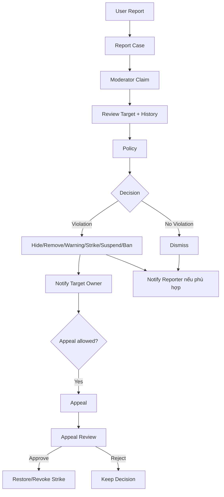

# Sprint8.md — Report, Moderation v2, Policy, Strike, Appeal và Copyright

> **Sprint Goal:** Hoàn thiện hệ thống Trust & Safety xuyên User/Creator/Admin với trạng thái, Policy, Audit và quyền rõ ràng.

---

# 1. Luồng nghiệp vụ mục tiêu



---

# 2. Vertical Slice S8-01 — Report phía User

Đối tượng:

- Video.
- Comment.
- Channel.
- User nếu scope có.

Form:

- Violation type.
- Reason.
- Description.
- Evidence nếu hỗ trợ.
- Submit.

User:

- Confirmation.
- Report History nếu có.
- Basic status.
- Notification kết quả theo policy.

Mobile:

- Bottom Sheet reason.
- Full-screen form nếu dài.

---

# 3. Vertical Slice S8-02 — Report Case Grouping

Nếu nhiều User report cùng một Target:

```text
1 Target
→ 1 active Report Case
→ N Report Entries/Reporters
```

Case hiển thị:

- Target.
- Reporter count.
- Reporter list.
- Violation reason distribution.
- Description/evidence.
- Created/updated.
- Moderator.
- Timeline.

Phải chống duplicate spam theo Business Rule.

---

# 4. Vertical Slice S8-03 — Moderation v2

Mở rộng Sprint 5 từ Video sang:

- Video.
- Comment.
- Channel.
- User.

Action:

- Claim.
- Release.
- Review.
- Dismiss.
- Resolve.
- Hide.
- Unhide.
- Remove.
- Restore.
- Warning.
- Strike.
- Suspend.
- Ban.
- Unban.
- Escalate.
- Reopen.

State case:

```text
Pending
InReview
Resolved
Dismissed
Escalated
```

---

# 5. Vertical Slice S8-04 — Policy và Policy Version

Policy:

- Code.
- Name.
- Group.
- Content.
- Severity.
- Target type.
- Draft.
- Published.
- Archived.
- Version.
- Effective date.
- Expire date nếu có.

Business Rule:

- Decision phải tham chiếu version Policy tại thời điểm xử lý.
- Sửa policy published không làm thay đổi lịch sử case cũ.
- Publish là action có Permission/Audit.

---

# 6. Vertical Slice S8-05 — Warning / Strike / Enforcement

Strike:

- Target Type.
- Target ID.
- Policy.
- Severity.
- Reason.
- Moderator.
- Created.
- Expire.
- State.
- Source Case.
- Evidence.

Severity:

```text
Low
Medium
High
Critical
```

State:

```text
Active
Expired
Revoked
```

Enforcement:

- Warning.
- Feature restriction nếu có.
- Suspend.
- Ban.

Không hard-code “3 strike = ban” trên UI; rule phải nằm Business Rule/Config.

---

# 7. Vertical Slice S8-06 — Appeal

Đối tượng có thể appeal:

- Removed Video.
- Removed Comment.
- Strike.
- Suspended Channel.
- Suspended/Banned Account nếu policy cho phép.

User form:

- Decision.
- Reason.
- Description.
- Evidence.

State:

```text
Pending
InReview
Approved
Rejected
Escalated
```

Approve có thể:

- Restore Content.
- Revoke Strike.
- Revert restriction.

Không xóa lịch sử decision cũ.

---

# 8. Vertical Slice S8-07 — Copyright

Creator/User:

- Video URL.
- Nội dung bị sử dụng.
- Reason.
- Description.
- Contact.
- Evidence.
- Declaration.
- Submit.

State:

```text
Draft
Submitted
InReview
NeedMoreInfo
Approved
Rejected
Withdrawn
```

Chức năng:

- Track.
- Timeline.
- Need More Info.
- Add info.
- Withdraw.

Admin/Reviewer:

- Review.
- Request Info.
- Approve.
- Reject.
- Link action/case nếu cần.

---

# 9. Vertical Slice S8-08 — Admin User Management đầy đủ

Admin xem:

- Profile.
- Email verify.
- Plan current.
- Activity.
- Watch/Search History theo quyền/chính sách.
- Comments.
- Channel.
- Report count.
- Strike.
- Ban history.
- Session/last login.

Action:

- Suspend.
- Ban.
- Unban.
- Force Logout.
- Send notification/email.
- Internal note.
- View Audit.

Permission phải kiểm soát từng action.

---

# 10. Vertical Slice S8-09 — Admin Channel Management

- List.
- Search.
- Filter.
- Owner.
- Subscriber.
- Video count.
- View.
- Storage.
- Reports.
- Strike.
- Activity.
- Suspend.
- Ban.
- Unban.
- Strike.
- Remove Strike.
- Soft Delete/Restore theo permission.
- Open Channel/User view.

---

# 11. Vertical Slice S8-10 — Admin Video/Comment Management

## Video

- List.
- Filter.
- Detail.
- Preview.
- Metadata.
- Hide.
- Unhide.
- Remove.
- Restore.
- Strike.
- Related Report.
- Moderation History.

## Comment

- List.
- Filter.
- Thread context.
- Hide.
- Unhide.
- Remove.
- Restore.
- Strike/Warning theo Policy.
- Report link.

---

# 12. Vertical Slice S8-11 — Audit Log v2

Bắt buộc ghi:

- Login/Logout Admin.
- Failed Login.
- Create/Edit/Delete.
- Ban/Unban.
- Suspend.
- Strike/Revoke.
- Hide/Remove/Restore.
- Moderation decision.
- Report decision.
- Appeal decision.
- Policy publish.
- Role/Permission change nếu có xảy ra.
- Old/New value khi phù hợp.
- Reason.
- Admin.
- Permission.
- Target.
- Timestamp.
- IP/User Agent nếu kiến trúc hỗ trợ.

Audit không cho Admin thông thường sửa/xóa.

---

# 13. Permission Sprint 8

Bổ sung/enforce các nhóm:

- `video.*`
- `comment.*`
- `channel.*`
- `user.*`
- `moderation.*`
- `report.*`
- `appeal.*`
- `policy.*`
- `audit.view`

Không cần chờ Sprint 9 UI Role Management mới dùng các Permission này; seed/migration được bổ sung ngay Sprint 8.

---

# 14. Unit Test Sprint 8

## Report

- Create valid report.
- Invalid target.
- Duplicate handling.
- Group same target.
- Reporter list.
- Dismiss/Resolve state.

## Moderation

- Claim concurrency.
- Wrong moderator.
- Reopen.
- Escalate.
- Remove/Restore state.

## Strike

- Create.
- Expire.
- Revoke.
- Severity.
- Policy required.
- Source case required theo rule.

## Appeal

- Chỉ decision hợp lệ được appeal.
- Duplicate appeal.
- Deadline nếu có.
- Approve restore.
- Reject keep.
- Escalate.

## Policy

- Draft edit.
- Published immutable/history rule.
- New version.
- Archive.

## Permission

- Moderator thiếu action permission.
- Support không mặc định ban.
- Finance không moderation.
- Auditor read-only.

---

# 15. Integration Test Sprint 8

## INT-S8-01 Report grouping

1. User A report Video X.
2. User B report X.
3. Query Case.

Expected:

- 1 case active.
- 2 reporter entries.

## INT-S8-02 Resolve violation

```text
Report
→ Claim
→ Review
→ Policy
→ Remove Video
→ Strike
→ Notification
→ Audit
```

Expected:

- State nhất quán trong transaction/workflow.

## INT-S8-03 Dismiss

- Target không vi phạm.
- Dismiss.
- Không tạo Strike.
- Reporter notification theo rule.

## INT-S8-04 Appeal approve

- Removed content.
- User appeal.
- Reviewer approve.
- Restore.
- Revoke Strike nếu decision yêu cầu.

Expected:

- Old decision vẫn có History.

## INT-S8-05 Copyright NeedMoreInfo

- Submit.
- Reviewer NeedMoreInfo.
- User add evidence.
- Resume review.

---

# 16. E2E Sprint 8 — mô tả chi tiết

## E2E-S8-01 — Nhiều User report một Video

1. User A report Video.
2. User B report cùng Video.
3. Moderator mở Report Queue.
4. Open Case.

Expected:

- Một case nhóm.
- Hiển thị hai Reporter + reason.
- Không tạo hai case xử lý độc lập nếu rule grouping là một case.

---

## E2E-S8-02 — Violation → Remove + Strike

1. Moderator Claim.
2. Preview Video.
3. Chọn Policy.
4. Remove.
5. Apply Strike.
6. Creator mở Notification.
7. Guest mở Video.

Expected:

- Video không phát.
- Creator thấy decision/Policy.
- Strike Center có Active Strike.
- Audit ghi Moderator/action.

---

## E2E-S8-03 — Report không hợp lệ

1. User report.
2. Moderator Review.
3. Dismiss.
4. User/target owner nhận thông báo theo rule.

Expected:

- Nội dung vẫn hoạt động.
- Không Strike.
- Case Closed/Dismissed.

---

## E2E-S8-04 — Appeal thành công

1. Creator có Video Removed + Strike.
2. Submit Appeal.
3. Admin Appeal Reviewer Claim.
4. Approve.
5. Restore Video.
6. Revoke Strike nếu decision quy định.
7. Creator mở Video.

Expected:

- Video trở lại.
- Appeal Approved.
- Decision cũ không bị mất khỏi History.

---

## E2E-S8-05 — Appeal bị từ chối

1. Submit Appeal.
2. Reviewer Reject.
3. Creator xem kết quả.

Expected:

- Video/Strike giữ nguyên.
- Timeline đầy đủ.
- Không thể tự restore bằng deep API.

---

## E2E-S8-06 — Copyright Need More Info

1. Creator submit copyright request.
2. Reviewer yêu cầu bổ sung.
3. Creator nhận notification.
4. Bổ sung evidence.
5. Reviewer xử lý tiếp.

Expected:

- State đúng.
- Timeline rõ.
- Evidence mới persist.

---

## E2E-S8-07 — RBAC Trust & Safety

1. Login Support.
2. Open User detail.
3. Thử Ban.
4. Login Moderator.
5. Thực hiện action được phép.
6. Login Auditor.
7. Xem Audit.
8. Thử chỉnh dữ liệu.

Expected:

- Mỗi Role đúng scope.
- API enforce đầy đủ.

---

# 17. Sprint 8 Exit Criteria

- [ ] Report User Done.
- [ ] Report grouping Done.
- [ ] Moderation v2 Done.
- [ ] Policy Version Done.
- [ ] Strike/Enforcement Done.
- [ ] Appeal Done.
- [ ] Copyright Done.
- [ ] Admin User/Channel/Video/Comment management Done.
- [ ] Audit v2 Done.
- [ ] Permission Trust & Safety Done.
- [ ] Unit Test pass.
- [ ] Integration Test pass.
- [ ] E2E Report→Strike→Appeal pass.
