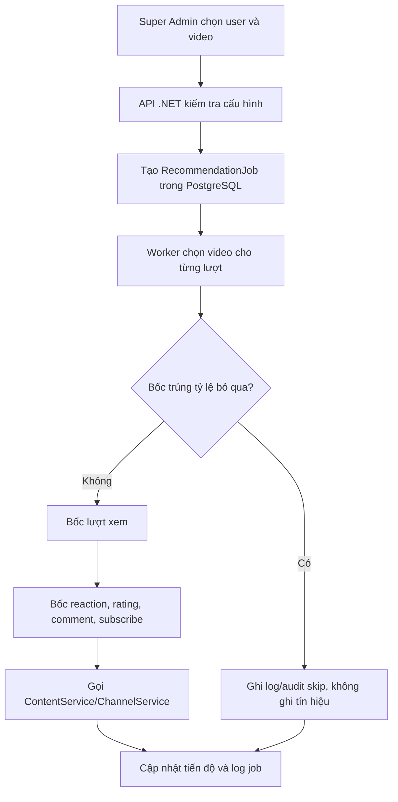

# Nguyên lý mô phỏng tương tác

Tài liệu này mô tả trình mô phỏng được tích hợp trong trang **Thuật toán đề xuất** (`/recommendations`). Trình mô phỏng tạo các tín hiệu hành vi có kiểm soát để kiểm tra ma trận user–video và đánh giá thuật toán CF. Nó không tự sinh dữ liệu khi không có ma trận và không đăng nhập hộ bằng mật khẩu của người dùng.

## Luồng tổng quát

Browser chỉ gọi các route quản trị của API .NET. Job chạy bất đồng bộ, vì vậy request tạo mô phỏng trả về `202` và `jobId`; giao diện dùng job đó để theo dõi tiến độ, log và dừng job.

## Đầu vào của một job

| Cấu hình | Ý nghĩa |
| --- | --- |
| `userIds` | Các tài khoản đang hoạt động sẽ nhận hành vi. Có thể là bot hoặc tài khoản thật. |
| `videoIds` | Danh sách video công khai, đã duyệt, đang xuất bản và có thời lượng lớn hơn 0. |
| `actionsPerUser` | Số **lượt thử tương tác** cho mỗi user. Đây không phải số tín hiệu chắc chắn được ghi, vì một lượt có thể bị skip hoặc bị chặn bởi điều kiện hiện có. |
| `viewRate` | Xác suất tạo lượt xem sau khi video không bị skip. |
| `likeRate`, `dislikeRate` | Xác suất reaction. Tổng hai giá trị không được vượt 100%. |
| `ratingRate` | Xác suất thử rating, sau khi kiểm tra reaction/rating hiện có. |
| `commentRate` | Xác suất thử bình luận khi kho bình luận có mẫu hợp lệ. |
| `subscribeRate` | Xác suất đăng ký kênh, sau khi kiểm tra điều kiện an toàn. |
| `videoSkipRate` | Xác suất bỏ qua toàn bộ video ở đầu mỗi lượt. Giao diện đặt mặc định 20%, cho phép từ 0 đến 100%. |
| `categoryRates` | Trọng số danh mục. Các tỷ lệ được chuẩn hóa thành tổng 100% trước khi gửi API. |

> Payload cũ có trường `watchPercent` vẫn được đọc để không làm hỏng job đã lưu, nhưng trường này không còn điều khiển thời lượng. Mọi lượt xem mới luôn dùng phân bố ngẫu nhiên 1–100%.

### User thật và bot

- Chỉ Super Admin mới gọi được các endpoint mô phỏng.
- Nếu danh sách có tài khoản thật, giao diện yêu cầu xác nhận và backend kiểm tra lại `confirmRealUsers`.
- Tạo bot tạo một `User` mới với email nội bộ dạng `.hutube.invalid` và mật khẩu ngẫu nhiên đã băm. Mật khẩu không được trả về giao diện và bot không đăng nhập hộ tài khoản nào.
- Mọi job và hành vi đều ghi người khởi chạy (`ActorUserId`) trong audit log.

## Chọn danh mục và video

### Trọng số danh mục

Mỗi danh mục được gán một trọng số từ 1 đến 10 ở giao diện. Trước khi gửi request, các trọng số được quy đổi thành tỷ lệ phần trăm nguyên và phần dư được phân bổ để tổng đúng 100%. Ví dụ trọng số `2/2/3/3` trở thành `20%/20%/30%/30%`.

Backend kiểm tra danh mục đang hoạt động, mỗi danh mục chỉ xuất hiện một lần và mỗi danh mục được chọn phải có ít nhất một video trong danh sách mô phỏng.

### Kịch bản user mục tiêu

Khi có `categoryRates`, worker tạo một kế hoạch video có trọng số danh mục cho từng user. Nếu request không truyền trọng số, worker lần lượt lấy video theo danh sách `videoIds` và lặp lại từ đầu khi hết danh sách.

### Kịch bản cụm bot/persona

Khi có `categoryRates`, cụm bot cũng dùng kế hoạch trọng số danh mục. Nếu không truyền trọng số, worker tạo kế hoạch gồm danh mục ưu tiên (`preferredCategoryId`, `preferredCategoryRatio`) và các danh mục còn lại, sau đó xáo trộn video trong từng nhóm.

Pool video trong mỗi danh mục được xáo trộn. Khi pool đã dùng hết, pool được tạo lại; vì vậy số lượt lớn hơn số video vẫn chạy được nhưng cùng một video có thể được chọn lại ở một chu kỳ sau.

## Nguyên lý một lượt mô phỏng

Với mỗi user và mỗi lượt:

1. Worker tải lại trạng thái job. Nếu job đã chuyển sang `cancelling`, worker dừng trước khi tạo hành vi tiếp theo.
2. Worker chọn một video theo kịch bản và danh mục đã cấu hình.
3. Worker kiểm tra video có thuộc user hoặc kênh của user hay không (`isOwnContent`). Điều kiện này dùng để chặn reaction, rating và subscribe vào nội dung của chính mình.
4. Worker bốc ngẫu nhiên `videoSkipRate`.
   - Nếu trúng: ghi `recommendations.simulated_skip` và một dòng `skip` vào log, tăng tiến độ, rồi chuyển sang lượt kế tiếp.
   - Không có lượt xem, reaction, rating, comment hoặc subscribe nào được gọi cho video đó.
5. Nếu không skip, worker bốc `viewRate`. Nếu trúng, worker bốc một số nguyên độc lập từ **1 đến 100%** cho lượt đó rồi gọi `ContentService.SaveProgressAsync`. Vì vậy thời lượng xem thay đổi theo từng lượt và không có một mốc cố định cho toàn bộ user.
6. Nếu user chưa có reaction cho cặp user–video và không phải nội dung của mình, worker bốc reaction. Reaction được chọn theo khoảng xác suất like/dislike.
   - Rating cũ từ 4–5 sao cho phép like tương thích.
   - Rating cũ từ 1–2 sao cho phép dislike tương thích.
   - Reaction không tương thích với rating cũ sẽ bị bỏ qua.
7. Nếu chưa có reaction và chưa có rating, worker có thể tạo rating.
   - Sau like, rating được chọn ngẫu nhiên 4 hoặc 5 sao.
   - Không có reaction, rating trung lập là 3 sao.
   - Dislike không tạo rating số mới.
8. Nếu `commentRate` trúng và kho bình luận có mẫu, worker chọn ngẫu nhiên một mẫu rồi gọi `ContentService.CreateCommentAsync`.
9. Worker chỉ subscribe nếu user không sở hữu video/kênh, chưa có reaction, không dislike, không có rating tiêu cực và chưa subscribe kênh đó.
10. Worker lưu tiến độ, tối đa 500 dòng log gần nhất và áp dụng `delayMs` trước lượt tiếp theo.

Các xác suất được áp dụng độc lập theo từng lượt, nhưng số hành vi thực tế còn phụ thuộc vào các điều kiện ở trên. Vì vậy `actionsPerUser = 20` không đồng nghĩa user chắc chắn có 20 lịch sử xem, 20 reaction hay 20 bình luận.

## Dữ liệu được ghi

### PostgreSQL

- `RecommendationJobs`: payload cấu hình, loại job, trạng thái, bước hiện tại, tổng lượt, lượt hoàn tất, lỗi và log gần nhất.
- Lịch sử xem, reaction, rating, bình luận và subscription được ghi qua các service nghiệp vụ hiện có.
- `AuditLogs`: ghi người khởi chạy, user đích, video, hành vi và `jobId`. Hành vi `skip` chỉ là audit/log, không tạo bản ghi tín hiệu trong các bảng tương tác.

### Ma trận CF

Khi chạy **Cập nhật mô hình**, backend đọc các tín hiệu thực có trong PostgreSQL và tạo ma trận mới. Các lượt skip không xuất hiện trong ma trận vì không tạo tín hiệu. Sau đó CSV ma trận được lưu lên R2 và Recommendation Service huấn luyện model theo job cập nhật model.

## Cách chọn tỷ lệ skip

`videoSkipRate` là tỷ lệ bỏ qua một video, không phải tỷ lệ giảm thời lượng xem:

- `0%`: không skip; dùng khi cần kiểm tra đường đi đầy đủ.
- `20%`: giá trị mặc định trên giao diện, tạo khoảng 1/5 lượt không phát sinh tín hiệu.
- `30–40%`: phù hợp khi muốn phân tán view mạnh hơn trên một tập video nhỏ.
- `100%`: tất cả lượt đều skip, job chỉ tạo log/audit và không làm thay đổi ma trận.

Tỷ lệ thực tế dao động quanh cấu hình vì mỗi lượt dùng một lần bốc ngẫu nhiên. Khi `videoSkipRate = 20%` và `viewRate = 100%`, xác suất một lượt tạo lịch sử xem xấp xỉ 80%, trước khi tính các điều kiện khác.

## Dừng và xử lý lỗi

- Nút **Dừng tiến trình** chuyển job sang `cancelling`. Worker kiểm tra trạng thái ở đầu mỗi lượt và kết thúc với trạng thái `cancelled`.
- Nếu một hành vi riêng lẻ lỗi, lỗi được ghi trong log của hành vi và worker tiếp tục các lượt sau.
- Nếu job lỗi ở cấp worker, job chuyển `failed` và lưu bước lỗi; những tín hiệu đã ghi trước đó không tự động rollback.
- Có thể dùng `Xóa logs` để ẩn các dòng log hiện tại trên giao diện; thao tác này không xóa `RecommendationJob` hay `AuditLogs` trong PostgreSQL.

## Giới hạn và lưu ý

- Mô phỏng không đại diện cho hành vi người thật; nó chỉ tạo tín hiệu có xác suất để kiểm tra pipeline CF.
- Tỷ lệ hành vi là xác suất thử hành vi, không phải tỷ lệ kết quả cuối cùng, vì hệ thống bỏ qua hành vi trùng lặp, không tương thích hoặc vi phạm điều kiện sở hữu nội dung.
- Tìm kiếm video vẫn cho phép tìm video đã xem; bộ lọc video đã xem thuộc luồng đề xuất, không thuộc trình mô phỏng.
- Không đặt token Recommendation Service, khóa R2 hoặc mật khẩu trong frontend hoặc file tài liệu.
